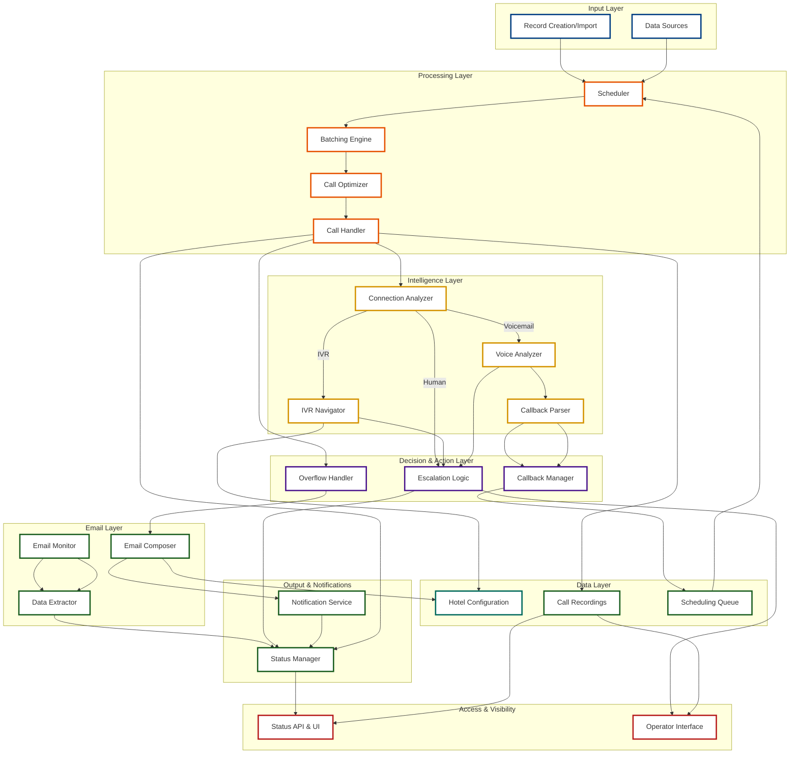
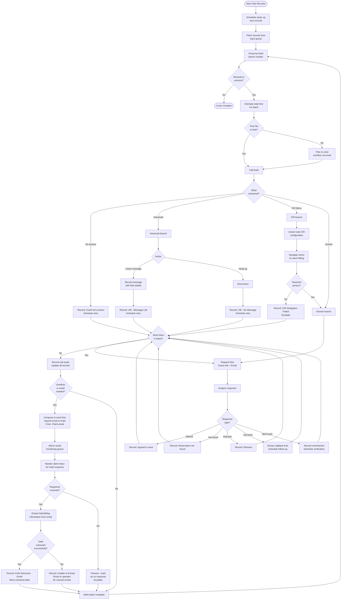
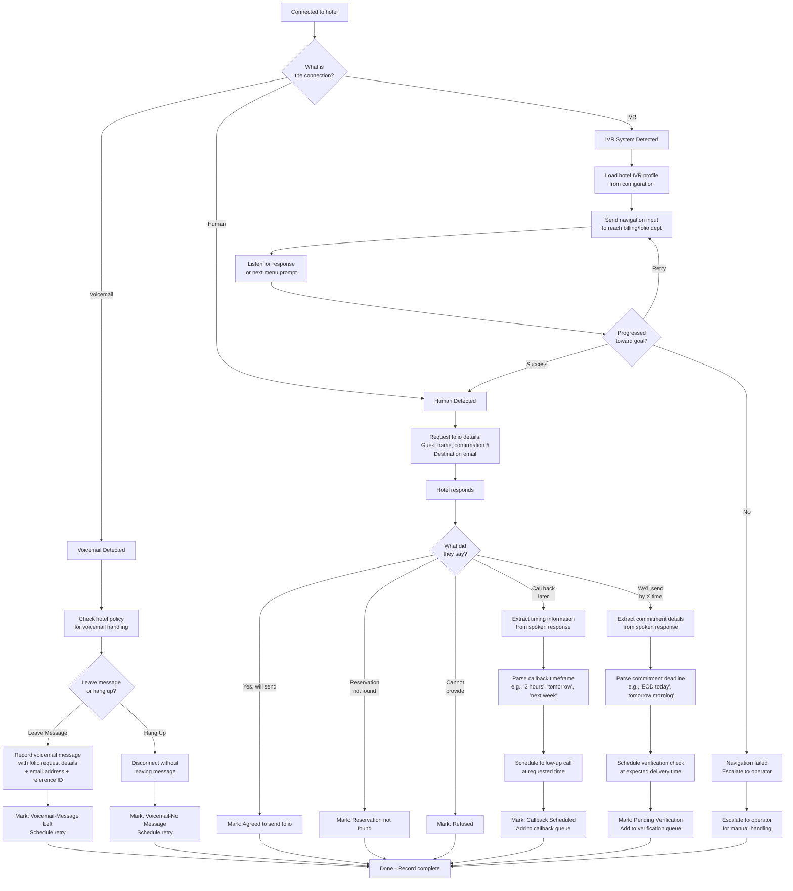
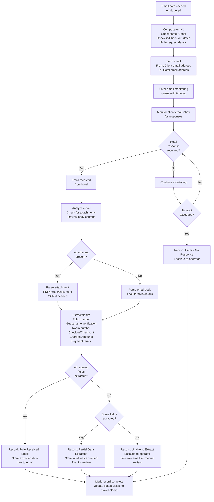
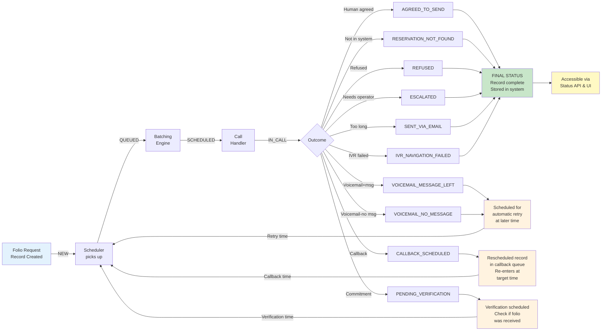
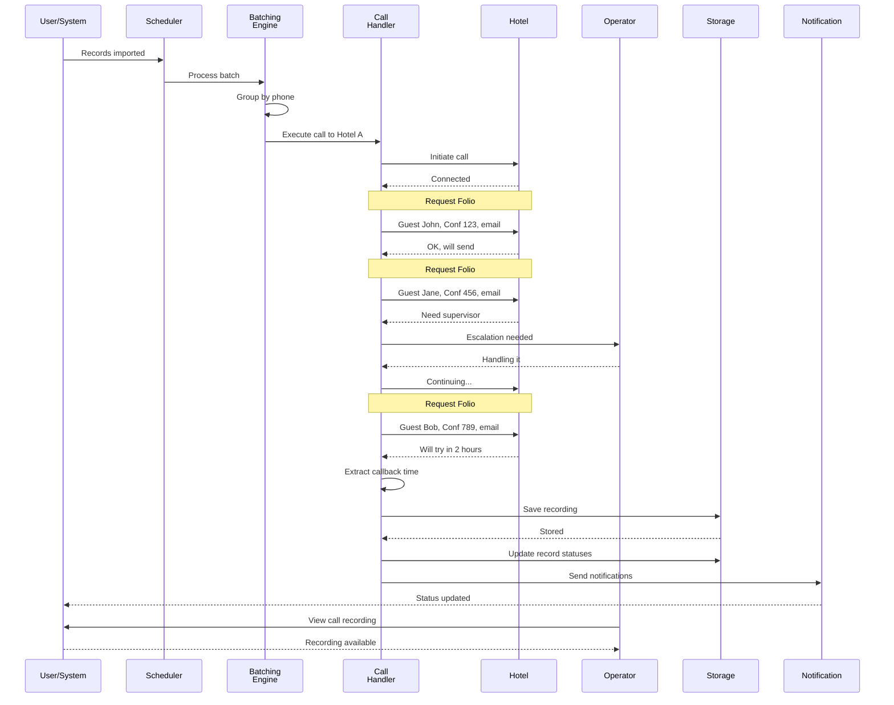

# Folio System - Logical Architecture & Flows

## Overview

This document presents the logical architecture and process flows of the Folio automation system. These are conceptual diagrams for stakeholders to understand system components, interactions, and decision logic. This is **not** a technical implementation topology or system design specification.

---

## System Architecture

Logical view of system components and how they relate:

### Component Descriptions

- **Scheduler**: Picks up new records on defined intervals; triggers calls and email requests
- **Batching Engine**: Groups records by hotel phone number
- **Call Optimizer**: Estimates call duration and determines request strategy
- **Call Handler**: Manages the actual communication with hotels via phone
- **Connection Analyzer**: Determines if connection is with person, IVR system, or voicemail
- **IVR Navigator**: Handles navigation of automated phone systems
- **Voice Analyzer**: Analyzes spoken responses and voicemail
- **Callback Parser**: Extracts timing information from callback requests
- **Escalation Logic**: Routes complex cases to human operators
- **Overflow Handler**: Manages requests that exceed call duration limits; routes to email
- **Callback Manager**: Schedules and tracks follow-up calls
- **Email Composer**: Creates and sends folio request emails to hotels
- **Email Monitor**: Monitors client email inbox for hotel responses
- **Data Extractor**: Extracts folio/billing information from email responses; parses attachments
- **Status Manager**: Updates record status based on call and email outcomes
- **Notification Service**: Sends emails and notifications
- **Call Recordings**: Stores and makes available all call audio
- **Hotel Configuration**: Stores hotel-specific details (IVR paths, email addresses, preferences)
- **Scheduling Queue**: Maintains callbacks, verification checks, and email response timeouts
- **Status API & UI**: Provides visibility to staff and operators
- **Operator Interface**: Allows real-time listening, intervention, and manual folio extraction review

---

## Critical Process Flow

How the system processes folio requests from start to finish:

---

## IVR & Voicemail Handling

How the system handles automated phone systems and voicemail:

---

## Email-Based Folio Request Flow

How the system handles email-based folio requests and response extraction:

---

## Record Lifecycle

How a folio request record progresses through the system:

---

## Component Interaction Sequence

Example of how components interact during a typical call:

