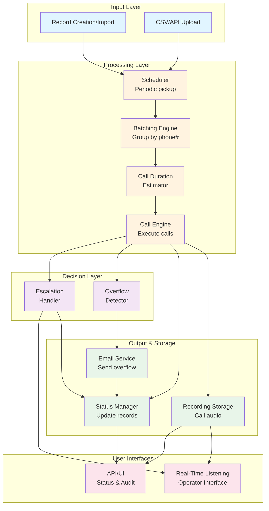
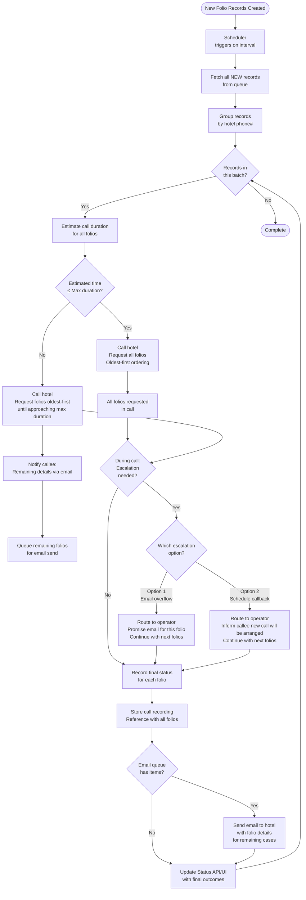
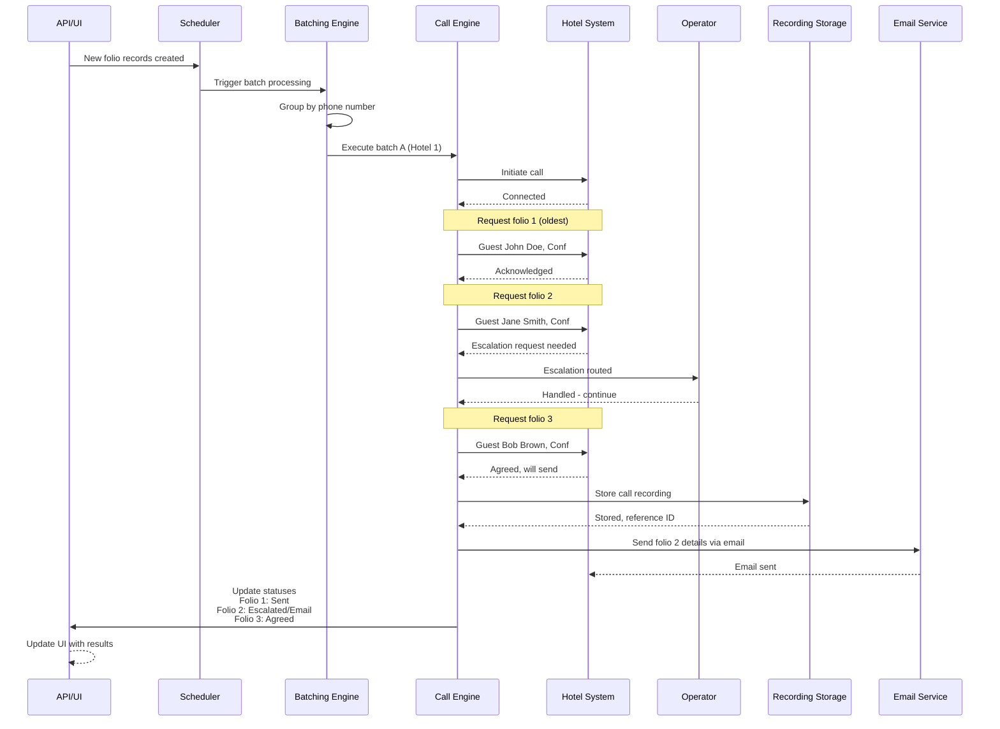
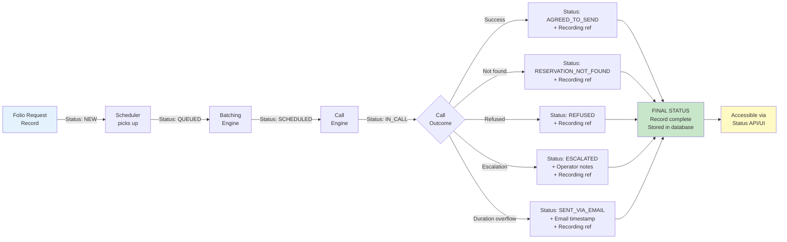

# Folio System - Architecture & Flow Diagrams

## System Architecture

```mermaid
graph TB
    subgraph Input["Input Layer"]
        A["Record Creation/Import"]
        B["CSV/API Upload"]
    end

    subgraph Processing["Processing Layer"]
        C["Scheduler<br/>Periodic pickup"]
        D["Batching Engine<br/>Group by phone#"]
        E["Call Duration<br/>Estimator"]
        F["Call Engine<br/>Execute calls"]
    end

    subgraph Decision["Decision Layer"]
        G["Escalation<br/>Handler"]
        H["Overflow<br/>Detector"]
    end

    subgraph Output["Output & Storage"]
        I["Status Manager<br/>Update records"]
        J["Recording Storage<br/>Call audio"]
        K["Email Service<br/>Send overflow"]
    end

    subgraph Interfaces["User Interfaces"]
        L["API/UI<br/>Status & Audit"]
        M["Real-Time Listening<br/>Operator Interface"]
    end

    A --> C
    B --> C
    C --> D
    D --> E
    E --> F
    F --> G
    F --> H
    G --> M
    G --> I
    H --> K
    F --> I
    F --> J
    I --> L
    J --> L
    J --> M
    K --> I

    style A fill:#e1f5ff
    style B fill:#e1f5ff
    style C fill:#fff3e0
    style D fill:#fff3e0
    style E fill:#fff3e0
    style F fill:#fff3e0
    style G fill:#f3e5f5
    style H fill:#f3e5f5
    style I fill:#e8f5e9
    style J fill:#e8f5e9
    style K fill:#e8f5e9
    style L fill:#fce4ec
    style M fill:#fce4ec
```

## Critical Process Flow

```mermaid
flowchart TD
    Start([New Folio Records Created]) --> Schedule["Scheduler<br/>triggers on interval"]

    Schedule --> Fetch["Fetch all NEW records<br/>from queue"]
    Fetch --> Group["Group records<br/>by hotel phone#"]

    Group --> Batch{Records in<br/>this batch?}
    Batch -->|Yes| Estimate["Estimate call duration<br/>for all folios"]
    Batch -->|No| End1([Complete])

    Estimate --> DurationCheck{Estimated time<br/>≤ Max duration?}

    DurationCheck -->|Yes| CallAll["Call hotel<br/>Request all folios<br/>Oldest-first ordering"]
    DurationCheck -->|No| CallPartial["Call hotel<br/>Request folios oldest-first<br/>until approaching max duration"]

    CallAll --> Result1["All folios requested<br/>in call"]
    CallPartial --> NotifyEmail["Notify callee:<br/>Remaining details via email"]
    NotifyEmail --> EmailQueue["Queue remaining folios<br/>for email send"]

    Result1 --> CallExecution{During call:<br/>Escalation<br/>needed?}
    CallPartial --> CallExecution

    CallExecution -->|Yes| EscalationChoice{Which escalation<br/>option?}
    CallExecution -->|No| RecordStatus["Record final status<br/>for each folio"]

    EscalationChoice -->|Option 1<br/>Email overflow| Escalate1["Route to operator<br/>Promise email for this folio<br/>Continue with next folios"]
    EscalationChoice -->|Option 2<br/>Schedule callback| Escalate2["Route to operator<br/>Inform callee new call will be arranged<br/>Continue with next folios"]

    Escalate1 --> RecordStatus
    Escalate2 --> RecordStatus

    RecordStatus --> RecordAudio["Store call recording<br/>Reference with all folios"]
    RecordAudio --> SendEmail{Email queue<br/>has items?}

    SendEmail -->|Yes| Email["Send email to hotel<br/>with folio details<br/>for remaining cases"]
    SendEmail -->|No| UpdateUI["Update Status API/UI<br/>with final outcomes"]

    Email --> UpdateUI
    UpdateUI --> Batch
```

## Component Interaction Flow

```mermaid
sequenceDiagram
    participant API as API/UI
    participant Scheduler as Scheduler
    participant Batch as Batching Engine
    participant CallEngine as Call Engine
    participant Hotel as Hotel System
    participant Operator as Operator
    participant Storage as Recording Storage
    participant Email as Email Service

    API->>Scheduler: New folio records created
    Scheduler->>Batch: Trigger batch processing
    Batch->>Batch: Group by phone number
    Batch->>CallEngine: Execute batch A (Hotel 1)
    CallEngine->>Hotel: Initiate call
    Hotel-->>CallEngine: Connected

    Note over CallEngine,Hotel: Request folio 1 (oldest)
    CallEngine->>Hotel: Guest John Doe, Conf#123, send to john@example.com
    Hotel-->>CallEngine: Acknowledged

    Note over CallEngine,Hotel: Request folio 2
    CallEngine->>Hotel: Guest Jane Smith, Conf#456, send to jane@example.com
    Hotel-->>CallEngine: Escalation request needed

    CallEngine->>Operator: Escalation routed
    Operator-->>CallEngine: Handled - continue

    Note over CallEngine,Hotel: Request folio 3
    CallEngine->>Hotel: Guest Bob Brown, Conf#789, send to bob@example.com
    Hotel-->>CallEngine: Agreed, will send

    CallEngine->>Storage: Store call recording
    Storage-->>CallEngine: Stored, reference ID

    CallEngine->>Email: Send folio 2 details via email
    Email-->>Hotel: Email sent

    CallEngine->>API: Update statuses<br/>Folio 1: Sent<br/>Folio 2: Escalated/Email<br/>Folio 3: Agreed
    API-->>API: Update UI with results
```

## Data Flow - Record Lifecycle

```mermaid
graph LR
    R["Folio Request<br/>Record"]

    R -->|Status: NEW| Scheduler["Scheduler<br/>picks up"]
    Scheduler -->|Status: QUEUED| Batch["Batching<br/>Engine"]
    Batch -->|Status: SCHEDULED| Call["Call<br/>Engine"]
    Call -->|Status: IN_CALL| Result{Call<br/>Outcome}

    Result -->|Success| Status1["Status: AGREED_TO_SEND<br/>+ Recording ref"]
    Result -->|Not found| Status2["Status: RESERVATION_NOT_FOUND<br/>+ Recording ref"]
    Result -->|Refused| Status3["Status: REFUSED<br/>+ Recording ref"]
    Result -->|Escalation| Status4["Status: ESCALATED<br/>+ Operator notes<br/>+ Recording ref"]
    Result -->|Duration overflow| Status5["Status: SENT_VIA_EMAIL<br/>+ Email timestamp<br/>+ Recording ref"]

    Status1 --> Final["FINAL STATUS<br/>Record complete<br/>Stored in database"]
    Status2 --> Final
    Status3 --> Final
    Status4 --> Final
    Status5 --> Final

    Final --> UI["Accessible via<br/>Status API/UI"]

    style R fill:#e3f2fd
    style Final fill:#c8e6c9
    style UI fill:#fff9c4
```

