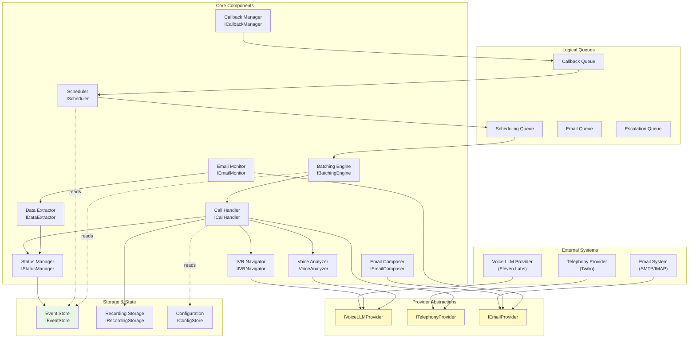
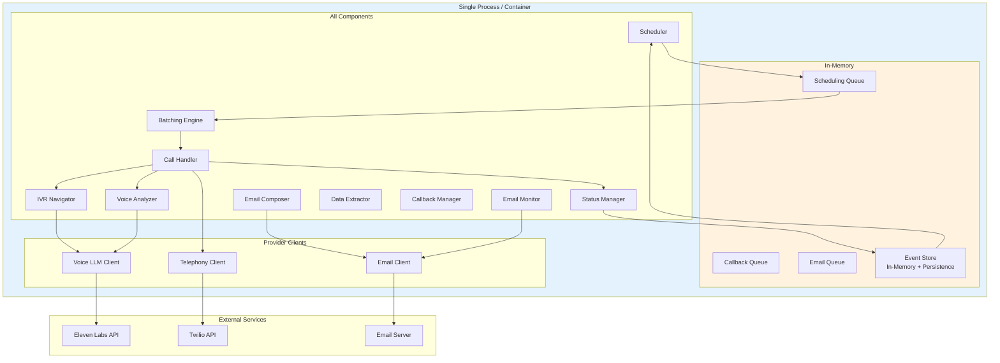
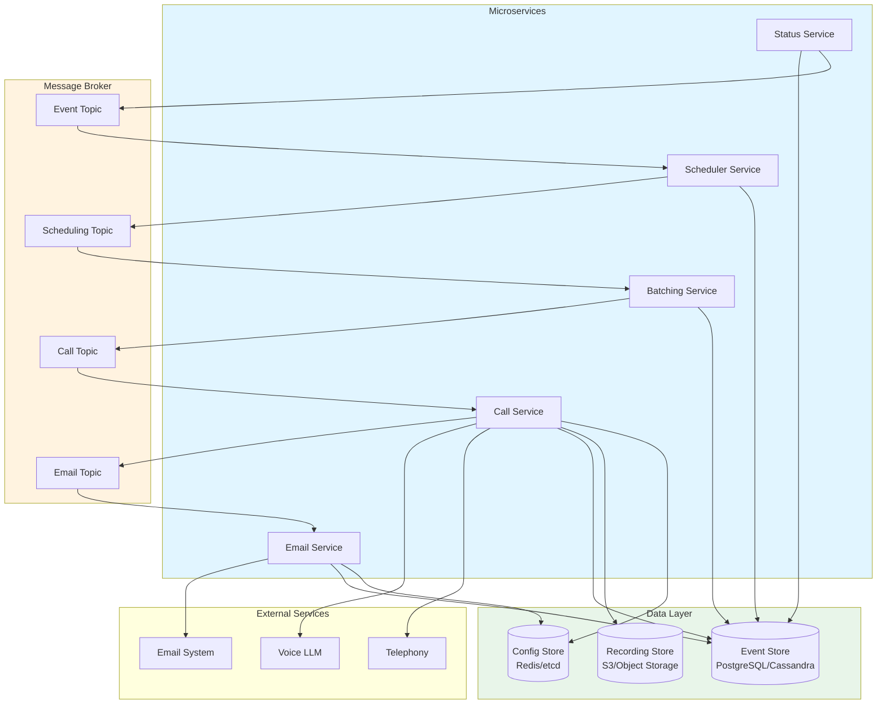

# Folio System - Technical Architecture & High-Level Design

## Document Overview

This document defines the technical architecture for the Folio automation system, including component interfaces, event-driven design, provider abstractions, and deployment models.

---

## Architecture Principles

### 1. Event-Driven Architecture
- **Immutable Events**: All state changes captured as immutable events
- **Event Sourcing**: Event log is the source of truth
- **No State Queries**: State reconstructed from events only
- **Event Replay**: Ability to rebuild state from event history

### 2. Component Modularity
- **Logical Interfaces**: All components defined via interfaces
- **Dependency Injection**: Components receive dependencies via interfaces
- **Swappable Implementations**: Provider abstractions for external services
- **Single Responsibility**: Each component has one clear purpose

### 3. Queue as Logical Construct
- **Short-term**: In-memory queue with interface abstraction
- **Long-term**: Actual message broker (Kafka, RabbitMQ)
- **Interface-based**: Queue operations abstracted behind IQueue interface

### 4. Inline Events for Decisions
- **Decision Events**: Emitted inline to guide next steps
- **Event-driven Flow**: Components react to events, not direct calls
- **Asynchronous by Design**: Even in monolithic deployment

### 5. LLM Context Management
- **Templates**: Predefined conversation templates
- **TOONs**: Tree of Observed Nodes for conversation state
- **JSON Schemas**: Structured data extraction formats
- **Context Window**: Managed template injection

---

## System Architecture Overview



---

## Short-Term Architecture (Single Deployable)

### Deployment Model



**Characteristics:**
- Single deployment unit
- In-memory queues with durable backing
- All components in same process
- Simplified debugging and testing
- Vertical scaling only
- Fast inter-component communication

---

## Long-Term Architecture (Distributed)

### Deployment Model



**Characteristics:**
- Independent deployment units
- Actual message broker (Kafka, RabbitMQ)
- Horizontal scaling per service
- Service mesh for observability
- Distributed event store
- Higher complexity, higher scale

---

## Core Component Interfaces

### IScheduler
**Purpose**: Picks up new records and triggers processing

**Interface:**
```
IScheduler {
  StartScheduling()
  StopScheduling()
  ProcessScheduledRecords()

  // Events Emitted
  RecordQueued(record_id, batch_id)

  // Events Consumed
  RecordCreated(record_id, data)
  CallbackScheduled(record_id, target_time)
  VerificationScheduled(record_id, check_time)
}
```

### IBatchingEngine
**Purpose**: Groups records by hotel phone number

**Interface:**
```
IBatchingEngine {
  GroupByHotel(record_ids) -> batches
  EstimateDuration(batch) -> duration

  // Events Emitted
  BatchCreated(batch_id, record_ids)
  BatchScheduled(batch_id, estimated_duration)

  // Events Consumed
  RecordQueued(record_id, batch_id)
}
```

### ICallHandler
**Purpose**: Manages phone call execution

**Interface:**
```
ICallHandler {
  InitiateCall(phone_number, batch_id)
  SendDTMF(call_id, tones)
  RequestFolio(call_id, guest_data)
  EndCall(call_id)

  // Events Emitted
  CallInitiated(call_id, phone_number)
  CallConnected(call_id, connection_type)
  FolioRequested(call_id, record_id, guest_data)
  CallEnded(call_id, duration)

  // Events Consumed
  BatchScheduled(batch_id, estimated_duration)
  IVRNavigationComplete(call_id, success)
  VoiceAnalysisComplete(call_id, response_type)
}
```

### IIVRNavigator
**Purpose**: Navigates automated phone menus

**Interface:**
```
IIVRNavigator {
  DetectIVR(call_id, audio_stream) -> boolean
  LoadIVRConfig(hotel_id) -> config
  NavigateMenu(call_id, target_department) -> success

  // Events Emitted
  IVRDetected(call_id, menu_options)
  IVRNavigationStarted(call_id, path)
  IVRNavigationComplete(call_id, success)
  IVRNavigationFailed(call_id, reason)

  // Events Consumed
  CallConnected(call_id, connection_type)
}
```

### IVoiceAnalyzer
**Purpose**: Analyzes speech and extracts information

**Interface:**
```
IVoiceAnalyzer {
  AnalyzeResponse(call_id, audio) -> ResponseType
  ExtractCallbackTime(call_id, speech) -> datetime
  DetectVoicemail(call_id, audio) -> boolean

  // Events Emitted
  VoicemailDetected(call_id)
  HumanDetected(call_id)
  CallbackRequested(call_id, target_time)
  FolioAgreed(call_id, record_id)
  FolioRefused(call_id, record_id, reason)

  // Events Consumed
  CallConnected(call_id, connection_type)
  FolioRequested(call_id, record_id, guest_data)
}
```

### IEmailComposer
**Purpose**: Creates and sends folio request emails

**Interface:**
```
IEmailComposer {
  ComposeRequest(record_id, guest_data) -> email
  SendEmail(email, hotel_email) -> email_id

  // Events Emitted
  EmailComposed(email_id, record_id)
  EmailSent(email_id, hotel_email, timestamp)
  EmailSendFailed(email_id, reason)

  // Events Consumed
  CallDurationExceeded(batch_id, remaining_records)
  EmailRequested(record_id, hotel_email)
}
```

### IEmailMonitor
**Purpose**: Monitors inbox for hotel responses

**Interface:**
```
IEmailMonitor {
  StartMonitoring()
  CheckForResponses() -> emails
  CorrelateToRequest(email) -> record_id

  // Events Emitted
  EmailResponseReceived(email_id, record_id, content)
  EmailTimeout(email_id, record_id)

  // Events Consumed
  EmailSent(email_id, hotel_email, timestamp)
}
```

### IDataExtractor
**Purpose**: Extracts folio data from emails

**Interface:**
```
IDataExtractor {
  ExtractFromEmail(email) -> folio_data
  ExtractFromAttachment(attachment) -> folio_data
  ValidateExtraction(folio_data) -> boolean

  // Events Emitted
  FolioExtracted(record_id, folio_data)
  ExtractionFailed(record_id, reason)
  PartialExtractionComplete(record_id, partial_data)

  // Events Consumed
  EmailResponseReceived(email_id, record_id, content)
}
```

### IStatusManager
**Purpose**: Updates record status based on events

**Interface:**
```
IStatusManager {
  UpdateStatus(record_id, status, metadata)
  GetCurrentStatus(record_id) -> status

  // Events Emitted
  StatusUpdated(record_id, old_status, new_status, timestamp)
  RecordCompleted(record_id, final_status)

  // Events Consumed
  [All events from other components]
}
```

---

## Provider Abstractions

### IVoiceLLMProvider
**Purpose**: Abstract voice AI capabilities

**Interface:**
```
IVoiceLLMProvider {
  SynthesizeSpeech(text, voice_config) -> audio
  TranscribeSpeech(audio) -> text
  AnalyzeIntent(text) -> intent
  DetectIVRMenu(audio) -> menu_options
  ParseCallbackTime(text) -> datetime
}
```

**Implementations:**
- `ElevenLabsProvider` (short-term)
- `CustomLLMProvider` (long-term)

### ITelephonyProvider
**Purpose**: Abstract call infrastructure

**Interface:**
```
ITelephonyProvider {
  InitiateCall(phone_number) -> call_id
  SendDTMF(call_id, tones)
  StartRecording(call_id) -> recording_id
  StopRecording(call_id) -> audio_file
  HangUp(call_id)
  GetCallStatus(call_id) -> status
}
```

**Implementations:**
- `TwilioProvider` (short-term)
- `CustomTelephonyProvider` (long-term)

### IEmailProvider
**Purpose**: Abstract email operations

**Interface:**
```
IEmailProvider {
  SendEmail(from, to, subject, body, attachments) -> email_id
  FetchEmails(folder, criteria) -> emails
  MarkAsRead(email_id)
  MoveToFolder(email_id, folder)
}
```

**Implementations:**
- `SMTPIMAPProvider`
- `GraphAPIProvider` (for O365/Exchange)

---

## Event Schema Design

### Event Structure

All events follow this structure:

```json
{
  "event_id": "uuid-v4",
  "event_type": "EventName",
  "aggregate_id": "folio_request_id",
  "aggregate_type": "FolioRequest",
  "sequence": 1,
  "timestamp": "2026-02-06T10:30:00Z",
  "correlation_id": "batch_id_or_call_id",
  "causation_id": "parent_event_id",
  "data": {
    // Event-specific payload
  },
  "metadata": {
    "user_id": "system",
    "service": "call-handler",
    "version": "1.0"
  }
}
```

### Event Types

**Lifecycle Events:**
- `RecordCreated`
- `RecordQueued`
- `BatchCreated`
- `BatchScheduled`

**Call Events:**
- `CallInitiated`
- `CallConnected`
- `IVRDetected`
- `IVRNavigationComplete`
- `VoicemailDetected`
- `HumanDetected`
- `FolioRequested`
- `CallbackRequested`
- `FolioAgreed`
- `FolioRefused`
- `CallEnded`

**Email Events:**
- `EmailComposed`
- `EmailSent`
- `EmailResponseReceived`
- `FolioExtracted`
- `ExtractionFailed`

**Status Events:**
- `StatusUpdated`
- `RecordCompleted`
- `EscalationTriggered`

See [Event-Catalog.md](./Event-Catalog.md) for complete event definitions.

---

## Queue Design

### IQueue Interface

```
IQueue<T> {
  Enqueue(item: T)
  Dequeue() -> T
  Peek() -> T
  Size() -> int
  Clear()
}
```

### Queue Types

1. **Scheduling Queue**
   - Items: `RecordId`
   - Consumer: Batching Engine
   - Priority: By creation time (oldest first)

2. **Callback Queue**
   - Items: `CallbackRequest(record_id, target_time)`
   - Consumer: Scheduler
   - Priority: By target_time

3. **Email Queue**
   - Items: `EmailRequest(record_id, hotel_email)`
   - Consumer: Email Composer
   - Priority: FIFO

4. **Escalation Queue**
   - Items: `EscalationRequest(record_id, reason)`
   - Consumer: Operator Interface
   - Priority: By severity

### Short-term Implementation
```
InMemoryQueue<T> implements IQueue<T> {
  private queue: List<T>
  private persistence: IQueuePersistence

  Enqueue(item) {
    queue.add(item)
    persistence.persist(item)
  }

  Dequeue() {
    item = queue.removeFirst()
    persistence.remove(item)
    return item
  }
}
```

### Long-term Implementation
```
MessageBrokerQueue<T> implements IQueue<T> {
  private topic: string
  private broker: IMessageBroker

  Enqueue(item) {
    broker.publish(topic, item)
  }

  Dequeue() {
    return broker.consume(topic)
  }
}
```

---

## State Management via Events

### Event Sourcing Pattern

**No Direct State Queries** - State is always reconstructed from events:

```
function GetRecordState(record_id):
  events = EventStore.GetEvents(record_id)
  state = new RecordState()

  for event in events:
    state = state.Apply(event)

  return state
```

### Aggregate Pattern

Each `FolioRequest` is an aggregate:

```
class FolioRequestAggregate {
  private events: List<Event>
  private state: RecordState

  Apply(event: Event) {
    this.events.append(event)
    this.state = this.state.ApplyEvent(event)
  }

  GetState() -> RecordState {
    return this.state
  }

  GetEvents() -> List<Event> {
    return this.events
  }
}
```

### State Reconstruction

```
RecordState {
  status: string
  call_history: List<CallAttempt>
  email_history: List<EmailAttempt>
  extracted_data: FolioData

  ApplyEvent(event) -> RecordState {
    match event.type:
      case "CallInitiated":
        return this.with(
          call_history: this.call_history.append(event.data)
        )
      case "FolioExtracted":
        return this.with(
          extracted_data: event.data.folio,
          status: "FOLIO_RECEIVED"
        )
      // ... other events
  }
}
```

---

## LLM Context Management

### Template System

**Call Templates:**
```json
{
  "template_id": "folio_request_initial",
  "context": {
    "role": "assistant",
    "task": "Request hotel folio for guest",
    "tone": "professional, polite"
  },
  "prompt": "Hello, I'm calling to request a folio for guest {guest_name}, confirmation number {conf_number}, who stayed from {checkin} to {checkout}. Could you please send the folio to {email}?"
}
```

### TOON Structure (Tree of Observed Nodes)

```json
{
  "conversation_id": "call_123",
  "nodes": [
    {
      "node_id": 1,
      "type": "system_utterance",
      "content": "Request folio for John Doe",
      "timestamp": "2026-02-06T10:30:00Z"
    },
    {
      "node_id": 2,
      "type": "hotel_response",
      "content": "What was the confirmation number?",
      "timestamp": "2026-02-06T10:30:05Z",
      "parent_node": 1
    },
    {
      "node_id": 3,
      "type": "system_utterance",
      "content": "Confirmation ABC123",
      "timestamp": "2026-02-06T10:30:10Z",
      "parent_node": 2
    }
  ],
  "current_node": 3,
  "context_window": [1, 2, 3]
}
```

### JSON Schemas for Extraction

```json
{
  "schema_name": "folio_extraction",
  "fields": {
    "folio_number": {"type": "string", "required": true},
    "guest_name": {"type": "string", "required": true},
    "check_in": {"type": "date", "required": true},
    "check_out": {"type": "date", "required": true},
    "room_number": {"type": "string", "required": false},
    "charges": {
      "type": "array",
      "items": {
        "description": "string",
        "amount": "number",
        "date": "date"
      }
    },
    "total_amount": {"type": "number", "required": true}
  }
}
```

---

## Technology Stack Considerations

### Language-Agnostic Design
All interfaces designed to be implementable in:
- Python
- Go
- Java/Kotlin
- Node.js/TypeScript
- C#

### Event Store Options
- **Short-term**: PostgreSQL with JSONB, SQLite with event table
- **Long-term**: EventStoreDB, Apache Kafka, Cassandra

### Message Broker Options
- **Long-term**: Apache Kafka, RabbitMQ, NATS, AWS SQS/SNS

### Voice LLM Providers
- **Current**: Eleven Labs, OpenAI Realtime API
- **Future**: Custom LLM deployment

### Telephony Providers
- **Current**: Twilio, Vonage
- **Future**: Custom SIP/RTP implementation

---

## Deployment & Operations

### Short-Term Deployment
```
Docker Container:
- Single process application
- Embedded event store (SQLite + WAL)
- In-memory queues with persistence
- Provider clients bundled
- Health checks via HTTP
- Metrics via Prometheus client
```

### Long-Term Deployment
```
Kubernetes Deployment:
- Service per component
- Event store cluster (Kafka/EventStoreDB)
- Message broker cluster
- Distributed tracing (Jaeger/Zipkin)
- Service mesh (Istio/Linkerd)
- Horizontal pod autoscaling
```

### Observability
- **Metrics**: Prometheus + Grafana
- **Logs**: Structured logging (JSON)
- **Traces**: OpenTelemetry
- **Events**: Event log as audit trail

---

## Migration Path

### Phase 1: Monolithic (Months 1-6)
- Single deployable
- In-memory queues
- Embedded event store
- All providers via interfaces

### Phase 2: Modular Monolith (Months 6-12)
- Same deployment
- Module boundaries enforced
- Actual message passing internally
- Preparation for split

### Phase 3: Distributed (Months 12+)
- Service extraction
- External message broker
- Distributed event store
- Independent scaling

---

## Security Considerations

### Event Encryption
- Events containing PII encrypted at rest
- Encryption keys managed separately
- Audit trail of key access

### Provider Credentials
- Stored in secure vault (HashiCorp Vault, AWS Secrets Manager)
- Rotated regularly
- Never in event log

### Access Control
- RBAC for operator interface
- API authentication via JWT
- Service-to-service auth via mTLS (long-term)

---

## References

- [Component Designs](./components/) - Individual component specifications
- [Event Catalog](./Event-Catalog.md) - Complete event definitions
- [Interface Definitions](./Interface-Definitions.md) - Detailed interface specs
- [Deployment Models](./Deployment-Models.md) - Infrastructure architecture

