# Component Design: Scheduler

## Overview
The Scheduler is responsible for picking up new folio request records at defined intervals and triggering the processing pipeline. It reads the event log to determine which records need processing and when.

## Interface

```
IScheduler {
  StartScheduling()
  StopScheduling()
  ProcessScheduledRecords()

  // Events Emitted
  RecordQueued(record_id, batch_id)
  RecordPickedUp(record_id, timestamp)

  // Events Consumed
  RecordCreated(record_id, data)
  CallbackScheduled(record_id, target_time)
  VerificationScheduled(record_id, check_time)
  RecordCompleted(record_id, final_status)
}
```

## Responsibilities

1. **Periodic Record Pickup**
   - Reads new records from input queue/source
   - Checks scheduling intervals (configurable)
   - Only processes NEW records that haven't been queued

2. **Callback Rescheduling**
   - Monitors callback queue
   - When callback time is reached, picks up record and requeues
   - Updates state to reflect retry attempt

3. **Verification Scheduling**
   - Monitors verification queue
   - When verification time reached, triggers email check or follow-up call
   - Updates status based on verification result

4. **Event Log Replay**
   - Reads past events to reconstruct current state
   - Doesn't update state directly; only reads events
   - Maintains idempotency (can replay safely)

## Flow Diagram

```mermaid
%%{init: {'fontSize': 18, 'fontFamily': 'arial'}}%%
flowchart TD
    Start["Start Scheduler"] --> Config["Load Configuration<br/>Check intervals"]
    Config --> Loop["Begin Cycle"]

    Loop --> ReadNew["Check for NEW records<br/>from event log"]
    ReadNew --> HasNew{Any new<br/>records?}
    HasNew -->|Yes| Queue["Enqueue to<br/>Scheduling Queue"]
    HasNew -->|No| CheckCallback

    Queue --> Emit1["Emit RecordQueued"]
    Emit1 --> CheckCallback["Check Callback Queue<br/>for ready callbacks"]

    CheckCallback --> ReadCallback["Read callback records<br/>with elapsed time"]
    ReadCallback --> HasCallback{Any ready<br/>callbacks?}
    HasCallback -->|Yes| RequeueCB["Re-enqueue to<br/>Scheduling Queue"]
    HasCallback -->|No| CheckVerify

    RequeueCB --> Emit2["Emit RecordQueued<br/>with retry flag"]
    Emit2 --> CheckVerify["Check Verification Queue<br/>for ready verifications"]

    CheckVerify --> ReadVerify["Read verification records<br/>with elapsed time"]
    ReadVerify --> HasVerify{Any ready<br/>verifications?}
    HasVerify -->|Yes| TriggerVerify["Trigger verification<br/>request"]
    HasVerify -->|No| Sleep

    TriggerVerify --> Emit3["Emit VerificationTriggered"]
    Emit3 --> Sleep["Sleep until next interval"]
    Sleep --> Loop

    style Start stroke:#003d82,fill:#ffffff,stroke-width:3px,font-size:16px
    style Loop stroke:#e65100,fill:#ffffff,stroke-width:3px,font-size:16px
    style Emit1 stroke:#1b5e20,fill:#ffffff,stroke-width:3px,font-size:16px
    style Emit2 stroke:#1b5e20,fill:#ffffff,stroke-width:3px,font-size:16px
    style Emit3 stroke:#1b5e20,fill:#ffffff,stroke-width:3px,font-size:16px
```



## Internal State Management

**Events Read (No State Queries):**
- `RecordCreated` - identifies new records
- `RecordQueued` - prevents duplicate queuing
- `CallbackScheduled` - identifies callback time
- `VerificationScheduled` - identifies verification time
- `RecordCompleted` - prevents reprocessing

**Events Emitted:**
- `RecordQueued` - triggers batching
- `RecordPickedUp` - audit trail
- `VerificationTriggered` - triggers verification action

## Configuration

```json
{
  "scheduler": {
    "schedule_interval_seconds": 30,
    "batch_size_max": 50,
    "callback_check_interval_seconds": 10,
    "verification_check_interval_seconds": 60,
    "startup_delay_seconds": 5,
    "enable_early_morning_skip": true,
    "early_morning_start_hour": 8,
    "early_morning_end_hour": 6
  }
}
```

## Failure Handling

1. **Duplicate Queuing Prevention**
   - Uses sequence numbers from events
   - Only queues records not yet marked as QUEUED

2. **Event Store Unavailable**
   - Retries with exponential backoff
   - Alerts on prolonged outage
   - Continues from last successful state

3. **Queue Overflow**
   - Monitors queue size
   - Pauses pickup when queue exceeds threshold
   - Resumes when queue drains

## Scalability Considerations

**Short-term:**
- Single scheduler instance
- Interval-based triggering
- In-memory queue

**Long-term:**
- Distributed schedulers with lease-based coordination
- Event stream processing (Kafka Streams)
- Horizontal scaling via partitioning by hotel

## Monitoring & Observability

**Metrics:**
- Records processed per cycle
- Queue size trends
- Callback backlog size
- Verification backlog size
- Processing latency (cycle time)

**Logs:**
- Record pickup events
- Callback rescheduling events
- Verification trigger events
- Errors and retries

**Events:**
- All events emitted are logged for audit

