# Component Design: Batching Engine

## Overview
The Batching Engine groups folio requests by hotel phone number to minimize call frequency and ensure efficient request handling. It estimates call duration and determines if overflow email handling is needed.

## Interface

```
IBatchingEngine {
  GroupByHotel(record_ids) -> List<Batch>
  EstimateDuration(batch) -> duration_seconds
  DetermineBatchSize(hotel_id) -> max_records

  // Events Emitted
  BatchCreated(batch_id, record_ids, hotel_phone)
  BatchScheduled(batch_id, estimated_duration, needs_overflow)
  BatchCancelled(batch_id, reason)

  // Events Consumed
  RecordQueued(record_id, batch_id)
}
```

## Responsibilities

1. **Batching Logic**
   - Groups records by hotel phone number
   - Single call per unique hotel
   - Maintains FIFO within batch (oldest first)

2. **Duration Estimation**
   - Estimates time per folio request (configurable)
   - Calculates total batch duration
   - Accounts for IVR navigation time
   - Accounts for voicemail time

3. **Overflow Detection**
   - Compares estimated duration with max call duration
   - Determines if overflow email needed
   - Flags which folios will be in email overflow

4. **Batch Validation**
   - Ensures all records have valid data
   - Validates hotel phone number
   - Checks for duplicate records in batch

## Flow Diagram

```mermaid
flowchart TD
    Start["Receive Queued Records"] --> Load["Load record details<br/>from event log"]
    Load --> Group["Group by hotel<br/>phone number"]

    Group --> Batch{Multiple records<br/>for same<br/>hotel?}

    Batch -->|Yes| CreateBatch["Create batch with<br/>all records"]
    Batch -->|No| SingleBatch["Create batch with<br/>single record"]

    CreateBatch --> Order["Order by creation<br/>timestamp<br/>oldest first"]
    SingleBatch --> Order

    Order --> Estimate["Estimate call duration:<br/>IVR time +<br/>Per-folio time"]

    Estimate --> EstResult{Total duration<br/>≤ max<br/>duration?}

    EstResult -->|Yes| NoOverflow["No overflow needed<br/>All folios in call"]
    EstResult -->|No| Overflow["Overflow detected<br/>Calculate split"]

    Overflow --> CalcSplit["Calculate how many<br/>folios fit in call"]
    CalcSplit --> MarkOverflow["Mark remaining folios<br/>for email"]

    NoOverflow --> Validate["Validate batch data"]
    MarkOverflow --> Validate

    Validate --> Valid{All data<br/>valid?}

    Valid -->|Yes| EmitBatch["Emit BatchCreated"]
    Valid -->|No| Cancel["Cancel batch<br/>Emit error event"]

    EmitBatch --> EmitSchedule["Emit BatchScheduled<br/>with duration<br/>and overflow flag"]
    Cancel --> Done["Done"]

    EmitSchedule --> Done

    style Start stroke:#1976d2,fill:#f5f5f5,stroke-width:2px
    style Estimate stroke:#f57c00,fill:#f5f5f5,stroke-width:2px
    style Overflow stroke:#d32f2f,fill:#f5f5f5,stroke-width:2px
    style EmitBatch stroke:#388e3c,fill:#f5f5f5,stroke-width:2px
```



## Duration Estimation Model

```json
{
  "duration_estimation": {
    "base_call_setup_seconds": 5,
    "ivr_navigation_seconds": 15,
    "per_folio_request_seconds": 30,
    "per_callback_response_seconds": 10,
    "per_email_request_seconds": 60,
    "buffer_percent": 20,
    "max_call_duration_seconds": 600
  },

  "example_calculation": {
    "scenario": "3 folios, IVR navigation needed",
    "base_setup": 5,
    "ivr_nav": 15,
    "folio_1": 30,
    "folio_2": 30,
    "folio_3": 30,
    "buffer_20_percent": 22,
    "total": 162,
    "fits_in_600s": true,
    "no_overflow": true
  }
}
```

## Batching Configuration

```json
{
  "batching": {
    "max_call_duration_seconds": 600,
    "max_folios_per_batch": 20,
    "enable_geographic_batching": false,
    "enable_time_window_batching": false,
    "batch_timeout_minutes": 30,
    "estimation": {
      "base_setup_seconds": 5,
      "ivr_nav_seconds": 15,
      "per_folio_seconds": 30
    }
  }
}
```

## Batch Structure

```json
{
  "batch": {
    "batch_id": "batch_20260206_hotel_15015551234_001",
    "hotel_phone": "+1-501-555-1234",
    "hotel_id": "hotel_001",
    "records": [
      {
        "record_id": "req_001",
        "sequence": 1,
        "guest_name": "John Doe",
        "conf_number": "ABC123",
        "checkin": "2026-02-01",
        "checkout": "2026-02-05",
        "created_at": "2026-02-05T10:00:00Z",
        "destination_email": "john@example.com"
      },
      {
        "record_id": "req_002",
        "sequence": 2,
        "guest_name": "Jane Smith",
        "conf_number": "DEF456",
        "checkin": "2026-02-02",
        "checkout": "2026-02-06",
        "created_at": "2026-02-05T10:05:00Z",
        "destination_email": "jane@example.com"
      }
    ],
    "estimated_duration_seconds": 120,
    "max_folios_in_call": 2,
    "overflow_records": [],
    "needs_overflow": false,
    "created_at": "2026-02-06T11:00:00Z"
  }
}
```

## Overflow Handling

When estimated duration exceeds max call duration:

```json
{
  "batch": {
    "batch_id": "batch_20260206_hotel_15015551234_002",
    "hotel_phone": "+1-501-555-1234",
    "records_total": 5,
    "estimated_duration_seconds": 195,
    "max_duration_seconds": 600,
    "fits": true,
    "notes": "All fit, no overflow needed"
  },

  "batch": {
    "batch_id": "batch_20260206_hotel_15015551234_003",
    "hotel_phone": "+1-501-555-1234",
    "records_total": 12,
    "estimated_duration_seconds": 1080,
    "max_duration_seconds": 600,
    "fits": false,
    "max_folios_in_call": 7,
    "overflow_records": 5,
    "overflow_strategy": "send_via_email",
    "call_folios": [
      {"record_id": "req_001", "sequence": 1, "priority": "oldest"}
    ],
    "email_folios": [
      {"record_id": "req_008", "sequence": 8},
      {"record_id": "req_009", "sequence": 9}
    ]
  }
}
```

## Failure Handling

1. **Invalid Hotel Phone**
   - Cancels batch
   - Marks records as INVALID
   - Escalates to operator

2. **Incomplete Record Data**
   - Skips record
   - Marks as INCOMPLETE
   - Continues with other records
   - Alerts operator

3. **Duration Estimation Failure**
   - Uses conservative estimate (max assumed)
   - Triggers overflow handling
   - Logs estimation error

## Scalability Considerations

**Short-term:**
- In-memory grouping
- Batch creation per cycle
- No persistence needed

**Long-term:**
- Parallel batch processing
- Stream-based batching (Kafka)
- Batch partitioning by hotel
- Distributed duration estimation

## Monitoring & Observability

**Metrics:**
- Batches created per cycle
- Average batch size
- Overflow percentage
- Duration estimation accuracy
- Batch validation failures

**Logs:**
- Batch creation events
- Overflow triggers
- Validation errors
- Duration estimates

