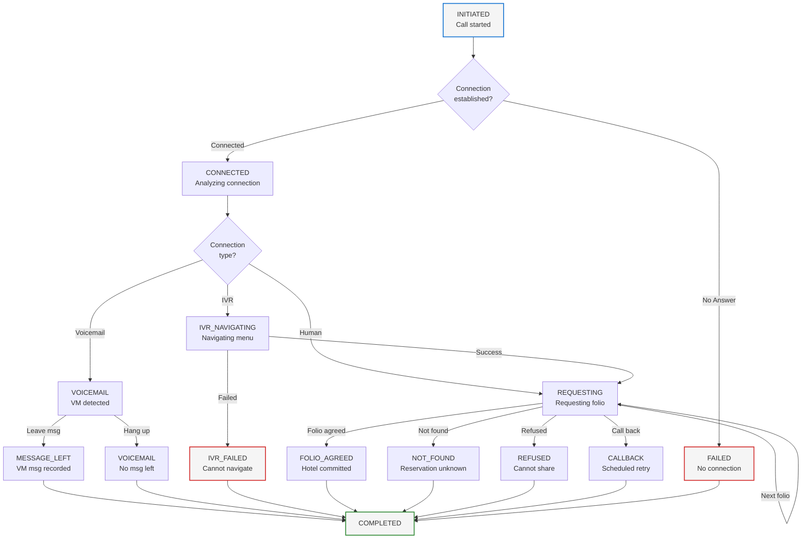
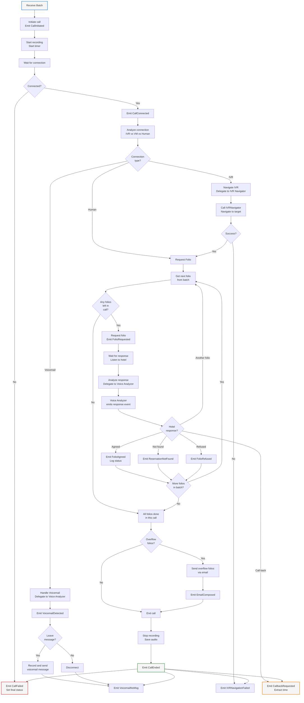

# Component Design: Call Handler

## Overview
The Call Handler orchestrates voice interactions with hotels. It manages the complete call lifecycle: initiating calls, delegating to specialized handlers (IVR Navigator, Voice Analyzer), managing call state, and emitting events for state transitions.

## Interface

```
ICallHandler {
  InitiateCall(phone_number, batch_id) -> call_id
  RequestFolio(call_id, record_id, guest_data) -> void
  HandleCallbackRequest(call_id, record_id, duration_text) -> void
  EndCall(call_id, status) -> void
  GetCallStatus(call_id) -> CallStatus

  // Events Emitted
  CallInitiated(call_id, phone_number, timestamp)
  CallConnected(call_id, connection_type, timestamp)
  FolioRequested(call_id, record_id, guest_name, conf_number, timestamp)
  CallEnded(call_id, duration_seconds, final_status, timestamp)
  CallFailed(call_id, error_code, error_message, timestamp)

  // Events Consumed
  BatchScheduled(batch_id, estimated_duration, needs_overflow)
  IVRNavigationComplete(call_id, success, timestamp)
  VoiceAnalysisComplete(call_id, response_type, extracted_data, timestamp)
}
```

## Responsibilities

1. **Call Lifecycle Management**
   - Initiates calls via Telephony Provider
   - Maintains call state
   - Records call metadata (duration, status, etc.)
   - Ends calls cleanly

2. **Call Orchestration**
   - Delegates to IVR Navigator when IVR detected
   - Delegates to Voice Analyzer when human detected
   - Handles voicemail scenarios
   - Manages timeouts and retries

3. **Folio Request Management**
   - Requests folios one by one (oldest first)
   - Manages call duration limits
   - Tracks remaining folios
   - Requests overflow folios via email

4. **Event Emission**
   - Emits all call events to event log
   - Maintains causation chain (call_id as correlation_id)
   - Includes full context in events

## Call State Machine



## Call Execution Flow



## Call Configuration

```json
{
  "call_handling": {
    "max_call_duration_seconds": 600,
    "max_folio_requests_per_call": 20,
    "folio_request_timeout_seconds": 30,
    "connection_timeout_seconds": 20,
    "retry_max_attempts": 3,
    "retry_interval_seconds": 300,
    "voicemail_handling": {
      "leave_message": true,
      "message_timeout_seconds": 10
    },
    "recording": {
      "enabled": true,
      "format": "wav",
      "storage_path": "/recordings"
    }
  }
}
```

## Call Context

```json
{
  "call_context": {
    "call_id": "call_20260206_150155512",
    "batch_id": "batch_20260206_hotel_15015551234_001",
    "hotel_phone": "+1-501-555-1234",
    "hotel_id": "hotel_001",
    "initiated_at": "2026-02-06T11:30:00Z",
    "state": "REQUESTING",
    "current_folio_index": 1,
    "total_folios": 3,
    "duration_elapsed_seconds": 45,
    "max_duration_seconds": 600,
    "folios_agreed": 1,
    "folios_not_found": 0,
    "folios_refused": 0,
    "recording_id": "rec_20260206_150155512"
  }
}
```

## Error Handling

1. **Call Initiation Failures**
   - No answer → Schedule retry
   - Line busy → Schedule retry
   - Invalid number → Mark as INVALID

2. **Connection Lost**
   - During IVR → Retry call
   - During folio request → Mark folio as PENDING_RETRY

3. **Timeout Handling**
   - Folio request timeout → Move to next folio
   - Connection timeout → Fail call

4. **Provider Errors**
   - Telephony provider down → Retry with exponential backoff
   - Voice LLM failure → Fall back to template-based handling

## Monitoring & Observability

**Metrics:**
- Calls initiated/completed/failed
- Average call duration
- Folio agreement rate
- IVR success rate
- Voicemail percentage

**Logs:**
- Call state transitions
- Folio requests per call
- Connection types (IVR/VM/Human)
- Error events

**Events:**
- All call events logged to event store
- Complete audit trail

