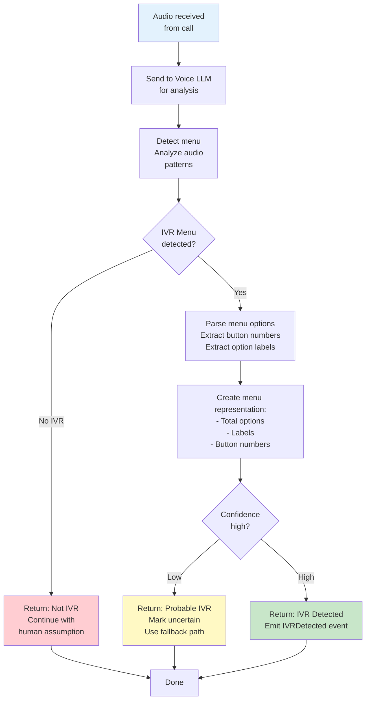
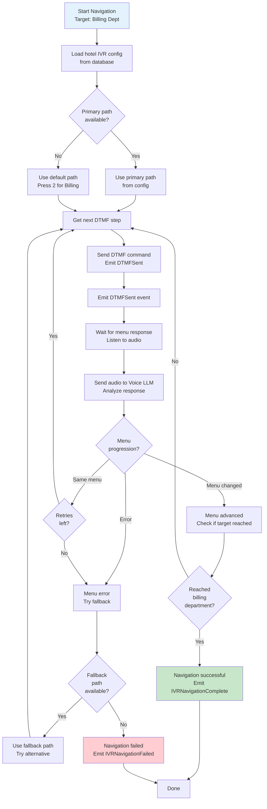

# Component Design: IVR Navigator

## Overview
The IVR Navigator detects and navigates automated phone menu systems. It uses the Voice LLM provider to understand menu options and send appropriate DTMF commands or voice input to reach the target department (billing/folio).

## Interface

```
IIVRNavigator {
  DetectIVR(call_id, audio_stream) -> boolean
  LoadIVRConfig(hotel_id) -> IVRConfig
  NavigateMenu(call_id, target_department, config) -> success

  // Events Emitted
  IVRDetected(call_id, menu_options)
  IVRNavigationStarted(call_id, target_path)
  DTMFSent(call_id, tones)
  IVRNavigationComplete(call_id, success)
  IVRNavigationFailed(call_id, reason, fallback_attempted)

  // Events Consumed
  CallConnected(call_id, connection_type)
}
```

## Responsibilities

1. **IVR Detection**
   - Analyzes initial audio
   - Identifies menu prompts
   - Detects option count and format
   - Falls back safely if detection uncertain

2. **Menu Navigation**
   - Uses hotel-specific configuration
   - Sends DTMF commands (button presses)
   - Interprets menu responses
   - Handles nested menus
   - Retries on failure

3. **Configuration Management**
   - Loads hotel IVR profiles
   - Caches successful navigation paths
   - Learns from successful calls

4. **Fallback Handling**
   - Attempts multiple navigation paths if available
   - Escalates to operator on persistent failure
   - Logs failed navigation attempts

## IVR Detection Flow



## IVR Navigation Flow



## IVR Configuration

```json
{
  "hotel_id": "hotel_001",
  "hotel_phone": "+1-501-555-1234",
  "ivr_profile": {
    "primary_path": [
      {"step": 1, "action": "wait_menu", "timeout_seconds": 5},
      {"step": 2, "action": "send_dtmf", "input": "2", "label": "Billing"},
      {"step": 3, "action": "wait_menu", "timeout_seconds": 5},
      {"step": 4, "action": "send_dtmf", "input": "1", "label": "Invoices"},
      {"step": 5, "action": "wait_human", "timeout_seconds": 10}
    ],
    "fallback_paths": [
      {
        "name": "Press 3 for Front Desk",
        "steps": [
          {"action": "send_dtmf", "input": "3"},
          {"action": "wait_human", "timeout_seconds": 10}
        ]
      }
    ],
    "success_indicators": [
      "Thank you for calling",
      "How can I help",
      "Please wait for"
    ],
    "error_indicators": [
      "invalid entry",
      "try again",
      "not a valid"
    ],
    "learning_enabled": true,
    "last_successful_call": "2026-02-05T14:30:00Z"
  }
}
```

## DTMF Commands

```json
{
  "dtmf_sequence": {
    "call_id": "call_20260206_150155512",
    "hotel_id": "hotel_001",
    "steps": [
      {
        "sequence": 1,
        "action": "send_dtmf",
        "tones": "2",
        "label": "Billing",
        "timestamp": "2026-02-06T11:30:10Z",
        "response_type": "menu_change"
      },
      {
        "sequence": 2,
        "action": "send_dtmf",
        "tones": "1",
        "label": "Invoices",
        "timestamp": "2026-02-06T11:30:15Z",
        "response_type": "human_detected"
      }
    ],
    "total_attempts": 2,
    "success": true,
    "duration_seconds": 5
  }
}
```

## Voice LLM Integration

Uses IVoiceLLMProvider for:

1. **Menu Detection**
   ```
   DetectIVRMenu(audio) -> {
     is_ivr: boolean,
     confidence: 0-1,
     menu_options: [
       {number: 1, label: "Reservations"},
       {number: 2, label: "Billing"}
     ]
   }
   ```

2. **Menu Analysis**
   ```
   AnalyzeMenuResponse(audio) -> {
     action_needed: "send_dtmf" | "wait" | "human",
     suggested_input: "2",
     confidence: 0-1,
     error_detected: boolean
   }
   ```

3. **Success Detection**
   ```
   DetectSuccess(audio) -> {
     reached_target: boolean,
     target_type: "human" | "menu" | "voicemail",
     confidence: 0-1
   }
   ```

## Failure Handling

1. **Menu Detection Failure**
   - Mark as non-IVR
   - Treat as human connection
   - Continue with folio request

2. **Navigation Failure (Primary Path)**
   - Try fallback path if available
   - If fallback also fails → Escalate to operator

3. **Timeout Handling**
   - Retry step with longer timeout
   - After 3 retries → Escalate

4. **Voice LLM Failures**
   - Fall back to DTMF-only navigation
   - Use template-based paths

## Monitoring & Observability

**Metrics:**
- IVR detection rate
- Navigation success rate
- Average navigation time
- Fallback usage percentage
- DTMF accuracy

**Logs:**
- Menu detection events
- DTMF commands sent
- Menu responses
- Navigation decisions
- Voice LLM calls and responses

