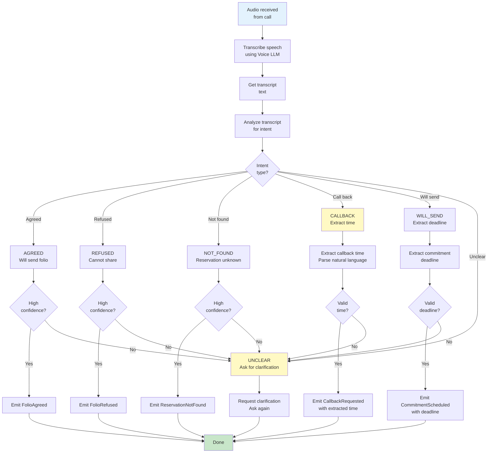

# Component Design: Voice Analyzer

## Overview
The Voice Analyzer processes spoken responses from hotels. It uses the Voice LLM provider to transcribe, understand intent, and extract information like callback times, folio agreements, and refusals.

## Interface

```
IVoiceAnalyzer {
  AnalyzeResponse(call_id, audio_stream) -> ResponseAnalysis
  ExtractCallbackTime(text) -> datetime
  TranscribeSpeech(audio) -> transcript
  DetectVoicemail(audio) -> boolean

  // Events Emitted
  VoicemailDetected(call_id)
  HumanDetected(call_id)
  TranscriptionComplete(call_id, transcript)
  IntentDetected(call_id, intent_type, confidence)
  CallbackExtracted(call_id, record_id, callback_time)
  FolioAgreed(call_id, record_id)
  FolioRefused(call_id, record_id, reason)
  ReservationNotFound(call_id, record_id)

  // Events Consumed
  FolioRequested(call_id, record_id, guest_data)
}
```

## Responsibilities

1. **Speech Transcription**
   - Converts audio to text using Voice LLM
   - Handles accent variations
   - Manages background noise
   - Extracts key information

2. **Intent Detection**
   - Identifies intent from transcription
   - Determines response type (agree/refuse/callback/not found)
   - Calculates confidence score
   - Handles ambiguous responses

3. **Information Extraction**
   - Extracts callback time from "call back in X hours/days"
   - Extracts commitment details from "we'll send by X"
   - Extracts refusal reasons if provided
   - Extracts confirmation of reservations

4. **Voicemail Detection**
   - Identifies voicemail greetings
   - Distinguishes from IVR
   - Determines next action (leave message/hang up)

## Audio Analysis Flow



## Intent Classification

```json
{
  "intent_analysis": {
    "call_id": "call_20260206_150155512",
    "record_id": "req_001",
    "timestamp": "2026-02-06T11:30:30Z",
    "original_audio": "recording.wav",
    "transcript": "Yes, I can send the folio for John Doe to that email address right away",
    "intent": {
      "primary_intent": "FOLIO_AGREED",
      "confidence": 0.95,
      "supporting_phrases": [
        "Yes",
        "can send",
        "folio",
        "right away"
      ],
      "sentiment": "positive"
    },
    "extracted_data": {
      "guest_confirmed": "John Doe",
      "willingness": "immediate",
      "delivery_method": "email"
    }
  }
}
```

## Callback Time Extraction

```json
{
  "callback_extraction": {
    "call_id": "call_20260206_150155512",
    "record_id": "req_001",
    "original_text": "We'll send that in about 2 hours",
    "extracted_timeframe": {
      "duration": 2,
      "unit": "hours",
      "absolute_time": "2026-02-06T13:30:00Z",
      "baseline_time": "2026-02-06T11:30:00Z",
      "confidence": 0.95,
      "parsing_method": "natural_language"
    },
    "examples": [
      {
        "text": "Call back tomorrow afternoon",
        "extracted_time": "next day 14:00:00"
      },
      {
        "text": "In about 3 days",
        "extracted_time": "+72 hours"
      },
      {
        "text": "Monday morning",
        "extracted_time": "next monday 09:00:00"
      },
      {
        "text": "By EOD",
        "extracted_time": "same day 17:00:00"
      }
    ]
  }
}
```

## Voicemail Detection

```json
{
  "voicemail_detection": {
    "call_id": "call_20260206_150155512",
    "audio_analysis": {
      "duration_seconds": 8,
      "characteristics": [
        "greeting_pattern",
        "no_spoken_content_by_human",
        "recording_tone",
        "press_key_instruction"
      ],
      "detected_phrases": [
        "Thank you for calling",
        "We cannot answer",
        "please leave a message",
        "at the tone"
      ]
    },
    "classification": {
      "is_voicemail": true,
      "confidence": 0.98,
      "voicemail_type": "auto_attendant",
      "leaves_option_to_record": true
    }
  }
}
```

## Template-based Response Handling

When Voice LLM is unavailable or low confidence:

```json
{
  "template_matching": {
    "transcript": "OK, I'll send that to you",
    "templates": [
      {
        "pattern": "will send|can send|shall send|send.*folio|send.*invoice",
        "intent": "FOLIO_AGREED",
        "confidence": "high"
      },
      {
        "pattern": "cannot share|cannot provide|prohibited|policy|confidential",
        "intent": "FOLIO_REFUSED",
        "confidence": "high"
      },
      {
        "pattern": "not found|don't have|no record|cannot locate",
        "intent": "RESERVATION_NOT_FOUND",
        "confidence": "high"
      },
      {
        "pattern": "call (back|later|again|tomorrow|in \\d+ (hours|days))",
        "intent": "CALLBACK_REQUESTED",
        "confidence": "medium"
      }
    ],
    "matched_template": "will send.*folio",
    "matched_intent": "FOLIO_AGREED"
  }
}
```

## Voice LLM Integration

Uses IVoiceLLMProvider for:

1. **Speech Transcription**
   ```
   TranscribeSpeech(audio) -> {
     text: string,
     confidence: 0-1,
     language: string,
     duration: float
   }
   ```

2. **Intent Classification**
   ```
   ClassifyIntent(text, context) -> {
     intent: "AGREED" | "REFUSED" | "CALLBACK" | "NOT_FOUND" | etc,
     confidence: 0-1,
     supporting_phrases: [string],
     sentiment: "positive" | "negative" | "neutral"
   }
   ```

3. **Entity Extraction**
   ```
   ExtractEntities(text) -> {
     callback_time: datetime | null,
     commitment_deadline: datetime | null,
     refusal_reason: string | null,
     extracted_fields: {key: value}
   }
   ```

## Fallback Strategy

1. **Transcription Failure**
   - Use template matching on audio patterns
   - Request clarification from hotel
   - Mark as NEEDS_CLARIFICATION

2. **Intent Classification Failure**
   - Use template matching on transcript
   - If still unclear, request clarification
   - Mark with low confidence

3. **Extraction Failure**
   - Request explicit information
   - Try parsing again with expanded templates
   - Escalate to operator if critical data

## Monitoring & Observability

**Metrics:**
- Transcription accuracy
- Intent classification accuracy
- Callback time extraction success rate
- Voicemail detection accuracy
- Voice LLM latency
- Fallback template usage

**Logs:**
- Transcriptions
- Intent classifications
- Extracted information
- Confidence scores
- Clarifications requested

