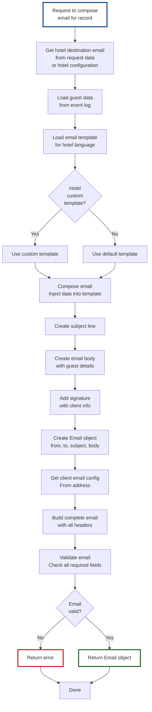
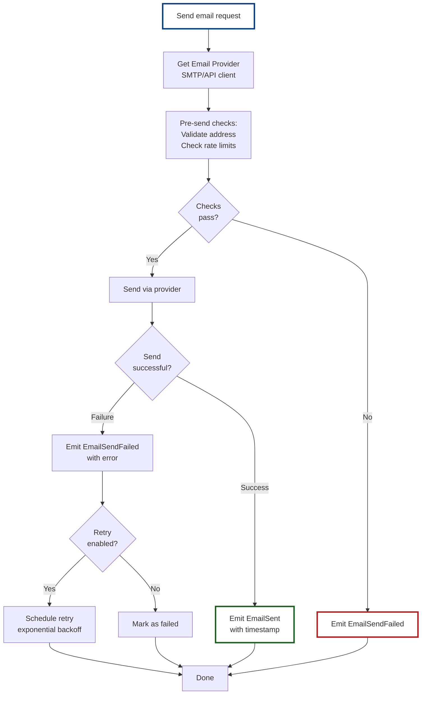

# Component Design: Email Composer

## Overview
The Email Composer creates and sends email requests to hotels for folio information. It composes professional emails with guest details and folio request information, then sends them via the Email Provider.

## Interface

```
IEmailComposer {
  ComposeRequest(record_id, guest_data, hotel_email) -> Email
  SendEmail(email) -> email_id
  ComposeReminder(email_id) -> Email
  SendReminder(reminder_email) -> email_id

  // Events Emitted
  EmailComposed(email_id, record_id, timestamp)
  EmailSent(email_id, hotel_email, timestamp)
  EmailSendFailed(email_id, hotel_email, error, timestamp)
  ReminderComposed(email_id, original_email_id, timestamp)
  ReminderSent(reminder_email_id, hotel_email, timestamp)

  // Events Consumed
  CallDurationExceeded(batch_id, remaining_records)
  EmailRequested(record_id, hotel_email)
}
```

## Responsibilities

1. **Email Composition**
   - Creates professional folio request emails
   - Includes guest details (name, confirmation #)
   - Includes stay dates
   - Provides clear call-to-action
   - Uses hotel-specific greeting if available

2. **Email Sending**
   - Sends via Email Provider (SMTP/API)
   - Tracks send status
   - Handles failures with retry
   - Logs all sends for audit

3. **Template Management**
   - Maintains email templates
   - Supports hotel-specific customization
   - Supports multi-language templates

4. **Reminder Management**
   - Sends follow-up reminders if no response
   - Tracks reminder attempts
   - Configurable reminder intervals

## Email Composition Flow



## Email Template System

### Default Template

```
Subject: Folio Request for {guest_name} - Confirmation {conf_number}

Body:
Dear Hotel Manager,

We are writing to request the folio/invoice for one of your guests:

Guest Name: {guest_name}
Confirmation Number: {conf_number}
Check-In Date: {checkin_date}
Check-Out Date: {checkout_date}

Please send the folio to: {destination_email}

This information will help us reconcile our records.

Thank you for your prompt attention to this matter.

Best regards,
{client_name}
{client_email}
Reference ID: {reference_id}
```

### Hotel-Specific Template Example

```json
{
  "template_id": "hotel_001_folio_request",
  "hotel_id": "hotel_001",
  "language": "en",
  "subject": "Invoice Request - Guest {guest_name}",
  "greeting": "Hello {hotel_contact_name},",
  "body": {
    "introduction": "We are following up on the stay of {guest_name} at your property.",
    "details": "Please provide the itemized invoice for this guest:",
    "guest_info": "Confirmation: {conf_number}, Dates: {checkin_date} to {checkout_date}",
    "delivery": "Please send to: {destination_email}",
    "closing": "We appreciate your cooperation.",
    "signature": "Best regards, {client_name}"
  }
}
```

## Email Object Structure

```json
{
  "email": {
    "email_id": "email_20260206_req001",
    "record_id": "req_001",
    "from_address": "invoices@client.com",
    "to_address": "billing@hotel.com",
    "subject": "Folio Request for John Doe - Confirmation ABC123",
    "body": "...",
    "html_body": "...",
    "headers": {
      "reply_to": "invoices@client.com",
      "return_path": "invoices@client.com"
    },
    "metadata": {
      "guest_name": "John Doe",
      "conf_number": "ABC123",
      "hotel_id": "hotel_001",
      "created_at": "2026-02-06T11:45:00Z",
      "reference_id": "ref_req_001"
    },
    "attachments": []
  }
}
```

## Email Sending Flow



## Configuration

```json
{
  "email_composer": {
    "default_language": "en",
    "default_from_name": "Invoice Team",
    "max_retries": 3,
    "retry_interval_seconds": 300,
    "batch_size": 50,
    "rate_limit": {
      "emails_per_minute": 30,
      "emails_per_hour": 1000
    },
    "templates": {
      "folder": "/config/email_templates",
      "cache_enabled": true
    },
    "provider": {
      "type": "smtp",
      "host": "smtp.client.com",
      "port": 587,
      "use_tls": true
    }
  }
}
```

## Email Provider Integration

Uses IEmailProvider for:

```
SendEmail(from, to, subject, body, headers, attachments) -> {
  email_id: string,
  sent_at: datetime,
  message_id: string (for tracking)
}
```

## Monitoring & Observability

**Metrics:**
- Emails composed per cycle
- Emails sent successfully
- Send failure rate
- Retry attempts
- Email latency

**Logs:**
- Email composition events
- Send attempts
- Failures and retries
- Rate limit events

