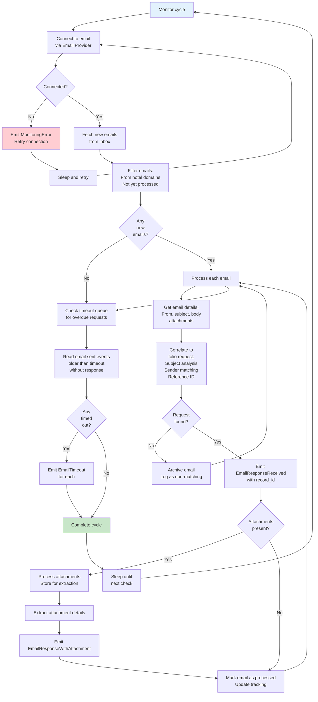

# Component Design: Email Monitor

## Overview
The Email Monitor continuously checks the client email inbox for responses from hotels. It correlates received emails to folio requests and passes them to the Data Extractor for information extraction.

## Interface

```
IEmailMonitor {
  StartMonitoring()
  StopMonitoring()
  CheckForResponses() -> List<Email>
  CorrelateToRequest(email) -> record_id
  MarkProcessed(email_id)

  // Events Emitted
  MonitoringStarted()
  EmailResponseReceived(email_id, record_id, sender, timestamp)
  EmailResponseWithAttachment(email_id, attachment_id, mime_type)
  EmailTimeout(record_id, original_email_id, timestamp)
  MonitoringError(error_message, timestamp)

  // Events Consumed
  EmailSent(email_id, hotel_email, timestamp)
}
```

## Responsibilities

1. **Inbox Monitoring**
   - Continuously checks email inbox
   - Filters for folio request responses
   - Detects new emails from known hotels
   - Handles authentication and connection

2. **Email Correlation**
   - Correlates responses to original requests
   - Uses reference IDs in subject/body
   - Uses sender address matching
   - Uses header analysis (In-Reply-To, References)

3. **Attachment Handling**
   - Identifies and extracts attachments
   - Stores for later processing
   - Handles multiple attachments
   - Logs attachment metadata

4. **Timeout Management**
   - Tracks email send timestamps
   - Identifies overdue responses
   - Escalates stale requests
   - Configurable timeout periods

## Email Monitoring Flow



## Email Correlation Logic

```json
{
  "correlation": {
    "email": {
      "message_id": "abc123@mail.hotel.com",
      "from": "billing@hotel.com",
      "subject": "RE: Folio Request for John Doe - Confirmation ABC123",
      "references": "<email_20260206_req001@client.com>",
      "in_reply_to": "<email_20260206_req001@client.com>",
      "body_contains": "Reference ID: ref_req_001"
    },
    "correlation_methods": [
      {
        "method": "reference_id_match",
        "pattern": "Reference ID: (\\w+)",
        "extracted": "ref_req_001",
        "success": true,
        "record_id": "req_001"
      },
      {
        "method": "in_reply_to_match",
        "email_id": "email_20260206_req001",
        "success": true,
        "record_id": "req_001"
      },
      {
        "method": "sender_hotel_match",
        "from_domain": "hotel.com",
        "known_hotel": "hotel_001",
        "hotel_has_pending_requests": true,
        "success": true,
        "record_id": "req_001"
      }
    ],
    "final_correlation": {
      "record_id": "req_001",
      "confidence": 0.99,
      "method_used": "reference_id_match"
    }
  }
}
```

## Timeout Management

```json
{
  "timeout_tracking": {
    "email_id": "email_20260206_req001",
    "record_id": "req_001",
    "sent_at": "2026-02-06T12:00:00Z",
    "timeout_seconds": 86400,
    "timeout_at": "2026-02-07T12:00:00Z",
    "current_time": "2026-02-07T13:30:00Z",
    "is_timed_out": true,
    "time_overdue_seconds": 5400
  },

  "timeout_configuration": {
    "default_timeout_hours": 24,
    "hotel_specific": [
      {
        "hotel_id": "hotel_001",
        "timeout_hours": 12
      },
      {
        "hotel_id": "hotel_002",
        "timeout_hours": 48
      }
    ]
  }
}
```

## Configuration

```json
{
  "email_monitor": {
    "check_interval_seconds": 60,
    "max_emails_per_check": 100,
    "timeout_default_hours": 24,
    "timeout_check_interval_minutes": 60,
    "connection": {
      "type": "imap",
      "host": "imap.client.com",
      "port": 993,
      "use_ssl": true,
      "folder": "INBOX"
    },
    "correlation": {
      "methods": [
        "reference_id",
        "in_reply_to",
        "sender_hotel_match",
        "subject_analysis"
      ],
      "required_confidence": 0.85
    },
    "attachment_handling": {
      "extract": true,
      "storage_path": "/attachments",
      "max_size_mb": 25,
      "supported_types": [
        "application/pdf",
        "image/jpeg",
        "image/png",
        "application/msword",
        "application/vnd.openxmlformats-officedocument.wordprocessingml.document"
      ]
    }
  }
}
```

## Email Provider Integration

Uses IEmailProvider for:

```
FetchEmails(folder, criteria) -> {
  emails: [
    {
      message_id: string,
      from: string,
      to: string,
      subject: string,
      body: string,
      html_body: string,
      received_at: datetime,
      attachments: [
        {
          filename: string,
          mime_type: string,
          size: int,
          data: binary
        }
      ]
    }
  ]
}

MarkAsRead(email_id)
MoveToFolder(email_id, folder_name)
```

## Failure Handling

1. **Connection Failure**
   - Retry with exponential backoff
   - Alert on persistent failure
   - Continue from last state

2. **Correlation Failure**
   - Mark email as unmatched
   - Archive for manual review
   - Flag for operator attention

3. **Attachment Processing Failure**
   - Log error
   - Still emit response event
   - Mark attachment for manual extraction

4. **Timeout Detection Failure**
   - Log error
   - Try again on next cycle
   - Use last known state

## Monitoring & Observability

**Metrics:**
- Emails checked per cycle
- Emails found/correlated
- Correlation success rate
- Timeout detection rate
- Attachment count
- Response time distribution

**Logs:**
- Connection events
- Email fetch counts
- Correlation attempts
- Timeout detections
- Errors and retries

