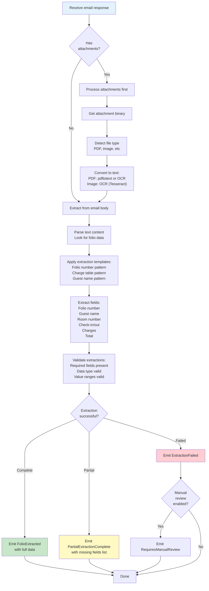

# Component Design: Data Extractor

## Overview
The Data Extractor processes email responses from hotels to extract folio and billing information. It handles both text content and attachments (PDFs, images), using OCR and template matching to extract structured data.

## Interface

```
IDataExtractor {
  ExtractFromEmail(email) -> ExtractionResult
  ExtractFromAttachment(attachment) -> ExtractionResult
  ValidateExtraction(folio_data) -> boolean
  ParseDocument(document_binary, mime_type) -> text_content

  // Events Emitted
  FolioExtracted(record_id, folio_data, confidence)
  PartialExtractionComplete(record_id, partial_data, missing_fields)
  ExtractionFailed(record_id, reason)
  RequiresManualReview(record_id, email_content)

  // Events Consumed
  EmailResponseReceived(email_id, record_id, email_content)
  EmailResponseWithAttachment(email_id, attachment_id, mime_type)
}
```

## Responsibilities

1. **Email Text Extraction**
   - Extracts folio data from email body
   - Uses template matching and NLP
   - Handles various text formats
   - Normalizes extracted data

2. **Document Processing**
   - Converts PDFs to text (OCR)
   - Extracts images (OCR)
   - Handles scanned documents
   - Extracts structured tables

3. **Data Extraction**
   - Extracts folio number
   - Extracts guest name
   - Extracts room number
   - Extracts charges and totals
   - Extracts dates and amounts

4. **Validation**
   - Validates extracted fields
   - Checks required fields present
   - Validates data types
   - Flags uncertain extractions

## Data Extraction Flow



## Extraction Templates

```json
{
  "extraction_schema": {
    "folio_number": {
      "patterns": [
        "Folio[:#\\s]+([A-Z0-9-]+)",
        "Invoice[:#\\s]+([A-Z0-9-]+)",
        "Folio #([\\d]+)",
        "Ref[.:]?[\\s]+([A-Z0-9-]+)"
      ],
      "required": true,
      "data_type": "string"
    },
    "guest_name": {
      "patterns": [
        "Guest[:#\\s]+([A-Za-z\\s]+)",
        "Name[:#\\s]+([A-Za-z\\s]+)"
      ],
      "required": false,
      "data_type": "string"
    },
    "room_number": {
      "patterns": [
        "Room[:#\\s]+([0-9]+)",
        "Room #([0-9]+)"
      ],
      "required": false,
      "data_type": "integer"
    },
    "check_in": {
      "patterns": [
        "Check[\\s-]*in[:#\\s]+([0-9]{1,2}[/-][0-9]{1,2}[/-][0-9]{2,4})",
        "Arrived[:#\\s]+([0-9]{1,2}[/-][0-9]{1,2}[/-][0-9]{2,4})"
      ],
      "required": true,
      "data_type": "date",
      "format": "MM/DD/YYYY"
    },
    "check_out": {
      "patterns": [
        "Check[\\s-]*out[:#\\s]+([0-9]{1,2}[/-][0-9]{1,2}[/-][0-9]{2,4})",
        "Departed[:#\\s]+([0-9]{1,2}[/-][0-9]{1,2}[/-][0-9]{2,4})"
      ],
      "required": true,
      "data_type": "date"
    },
    "total_amount": {
      "patterns": [
        "Total[:#\\s]+\\$?([0-9]+[.,][0-9]{2})",
        "Amount Due[:#\\s]+\\$?([0-9]+[.,][0-9]{2})"
      ],
      "required": true,
      "data_type": "decimal",
      "currency": "USD"
    },
    "charges": {
      "patterns": [
        "Room[\\s]+\\$?([0-9]+[.,][0-9]{2})",
        "Tax[\\s]+\\$?([0-9]+[.,][0-9]{2})"
      ],
      "required": false,
      "data_type": "array<charge>"
    }
  }
}
```

## Extracted Data Structure

```json
{
  "extraction_result": {
    "record_id": "req_001",
    "email_id": "email_20260206_req001",
    "extraction_timestamp": "2026-02-06T12:15:00Z",
    "extraction_method": "email_text",
    "confidence": 0.95,
    "status": "complete",
    "folio_data": {
      "folio_number": "2501",
      "guest_name": "John Doe",
      "room_number": "305",
      "check_in_date": "2026-02-01",
      "check_out_date": "2026-02-05",
      "stay_nights": 4,
      "charges": [
        {
          "description": "Room Rate",
          "amount": 400.00,
          "date": "2026-02-01"
        },
        {
          "description": "Room Rate",
          "amount": 400.00,
          "date": "2026-02-02"
        },
        {
          "description": "Room Rate",
          "amount": 400.00,
          "date": "2026-02-03"
        },
        {
          "description": "Room Rate",
          "amount": 400.00,
          "date": "2026-02-04"
        },
        {
          "description": "Tax",
          "amount": 160.00,
          "date": "2026-02-05"
        }
      ],
      "total_amount": 1760.00,
      "currency": "USD"
    },
    "extraction_details": {
      "fields_found": 7,
      "fields_required": 7,
      "fields_missing": [],
      "confidence_per_field": {
        "folio_number": 0.98,
        "guest_name": 0.92,
        "check_in_date": 0.99,
        "check_out_date": 0.99,
        "total_amount": 0.97
      }
    }
  }
}
```

## Document Processing

### PDF Processing
```
PDF → pdftotext (or OCR if scanned) → Raw Text → Extract Regions → Parse
```

### Image Processing (OCR)
```
Image → Tesseract OCR → Raw Text → Deskew/Preprocess → Extract → Parse
```

### Configuration

```json
{
  "data_extractor": {
    "pdf_processing": {
      "method": "pdftotext",
      "fallback_to_ocr": true,
      "ocr_engine": "tesseract"
    },
    "image_processing": {
      "ocr_engine": "tesseract",
      "preprocessing": {
        "deskew": true,
        "denoise": true,
        "enhance": true
      },
      "languages": ["eng"]
    },
    "extraction": {
      "method": "template_matching",
      "min_confidence": 0.70,
      "max_uncertain_fields": 2,
      "template_set": "default"
    },
    "validation": {
      "validate_dates": true,
      "validate_amounts": true,
      "validate_guest_name": true,
      "validate_total_matches_sum": true
    }
  }
}
```

## Failure Handling

1. **Text Extraction Failure**
   - Try OCR
   - Escalate to manual review

2. **Pattern Matching Failure**
   - Try multiple patterns
   - Mark as uncertain
   - Escalate if critical fields missing

3. **Validation Failure**
   - Log validation errors
   - Request manual review for discrepancies
   - Store partial data anyway

4. **Document Corruption**
   - Log error
   - Emit RequiresManualReview
   - Request new attachment

## Monitoring & Observability

**Metrics:**
- Extraction success rate
- Extraction confidence distribution
- Fields extracted successfully
- Manual review requests
- Processing time per document

**Logs:**
- Extraction attempts
- Pattern matches
- Validation failures
- Confidence scores
- Manual review flags

