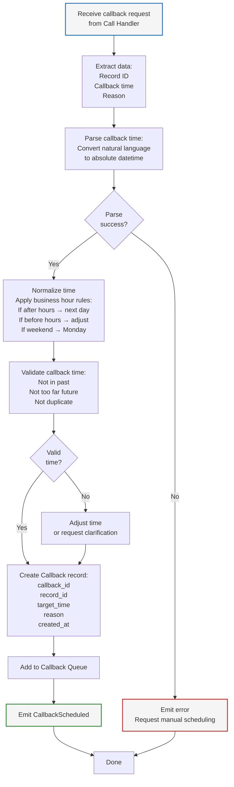
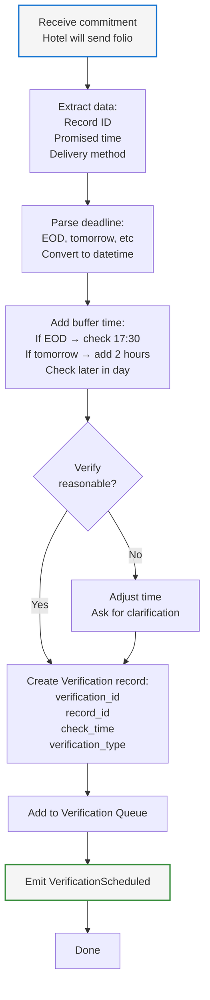

# Component Design: Callback Manager

## Overview
The Callback Manager schedules and tracks follow-up calls for situations where hotels request callbacks or when verification is needed. It manages callback queues and ensures calls are rescheduled at the appropriate times.

## Interface

```
ICallbackManager {
  ScheduleCallback(record_id, callback_time, reason) -> callback_id
  ScheduleVerification(record_id, verification_time, verification_type) -> verification_id
  GetPendingCallbacks() -> List<Callback>
  GetPendingVerifications() -> List<Verification>
  UpdateCallbackStatus(callback_id, status)

  // Events Emitted
  CallbackScheduled(record_id, callback_time, reason, callback_id)
  VerificationScheduled(record_id, verification_time, verification_type, verification_id)
  CallbackReady(callback_id, record_id, target_time)
  VerificationReady(verification_id, record_id, verification_type)

  // Events Consumed
  CallbackRequested(call_id, record_id, callback_time)
  CommitmentScheduled(record_id, commitment_deadline)
  RecordCompleted(record_id, final_status)
}
```

## Responsibilities

1. **Callback Scheduling**
   - Creates callback records from voice callbacks
   - Stores callback time extracted from conversation
   - Maintains audit trail
   - Applies business hour rules

2. **Verification Scheduling**
   - Schedules verification checks for commitments
   - Sets verification time based on promised deadline
   - Tracks verification type (email check, follow-up call)
   - Handles multiple verification attempts

3. **Queue Management**
   - Maintains sorted callback queue
   - Maintains verification queue
   - Checks for ready items each cycle
   - Prunes completed items

4. **Business Hour Enforcement**
   - Adjusts callback times to business hours
   - Prevents calls before/after hours
   - Respects hotel time zones (future enhancement)

## Callback Scheduling Flow



## Verification Scheduling Flow



## Callback/Verification Data Structures

```json
{
  "callback": {
    "callback_id": "cb_20260206_req001",
    "record_id": "req_001",
    "batch_id": "batch_20260206_hotel_15015551234_001",
    "created_at": "2026-02-06T11:35:00Z",
    "target_time": "2026-02-06T13:30:00Z",
    "reason": "Hotel requested callback",
    "extracted_timeframe": "2 hours",
    "original_phrase": "Please call back in about 2 hours",
    "status": "scheduled",
    "retry_attempt": 1,
    "max_retries": 3
  },

  "verification": {
    "verification_id": "ver_20260206_req001",
    "record_id": "req_001",
    "created_at": "2026-02-06T11:40:00Z",
    "check_time": "2026-02-07T17:30:00Z",
    "verification_type": "email_check",
    "commitment": "Will send folio by EOD tomorrow",
    "status": "scheduled",
    "attempt": 1,
    "max_attempts": 2
  }
}
```

## Queue Management

### Callback Queue
```json
{
  "callback_queue": [
    {
      "callback_id": "cb_001",
      "record_id": "req_001",
      "target_time": "2026-02-06T13:30:00Z",
      "reason": "2 hour callback"
    },
    {
      "callback_id": "cb_002",
      "record_id": "req_002",
      "target_time": "2026-02-06T14:00:00Z",
      "reason": "tomorrow morning"
    }
  ]
}
```

### Verification Queue
```json
{
  "verification_queue": [
    {
      "verification_id": "ver_001",
      "record_id": "req_001",
      "check_time": "2026-02-07T17:30:00Z",
      "verification_type": "email_check"
    }
  ]
}
```

## Business Hour Rules

```json
{
  "business_hour_rules": {
    "enabled": true,
    "timezone": "America/Chicago",
    "call_hours": {
      "start": "08:00",
      "end": "18:00"
    },
    "working_days": [1, 2, 3, 4, 5],
    "holidays": [
      "2026-12-25",
      "2026-01-01"
    ],
    "adjustments": {
      "if_after_hours": "push_to_next_morning",
      "if_before_hours": "push_to_business_start",
      "if_weekend": "push_to_monday",
      "if_holiday": "push_to_next_business_day"
    }
  }
}
```

## Configuration

```json
{
  "callback_manager": {
    "max_callback_attempts": 3,
    "max_verification_attempts": 2,
    "callback_timeout_days": 7,
    "verification_timeout_days": 3,
    "business_hours_enforcement": true,
    "default_timezone": "America/Chicago"
  }
}
```

## Failure Handling

1. **Callback Time Parsing Failure**
   - Request manual scheduling
   - Escalate to operator
   - Use conservative estimate

2. **Business Hour Adjustment Creates Too-Far Future**
   - Request clarification from operator
   - Use original time if reasonable
   - Log warning

3. **Duplicate Callbacks**
   - Detect via record_id and timeframe
   - Merge or skip duplicate
   - Log event

4. **Stale Callbacks**
   - Remove after callback_timeout_days
   - Mark as abandoned
   - Alert operator

## Monitoring & Observability

**Metrics:**
- Callbacks scheduled per cycle
- Callbacks ready for retry
- Verifications scheduled
- Callback success rate
- Average callback delay
- Business hour adjustments made

**Logs:**
- Callback scheduling events
- Time parsing attempts
- Business hour adjustments
- Queue management events
- Timeout events

