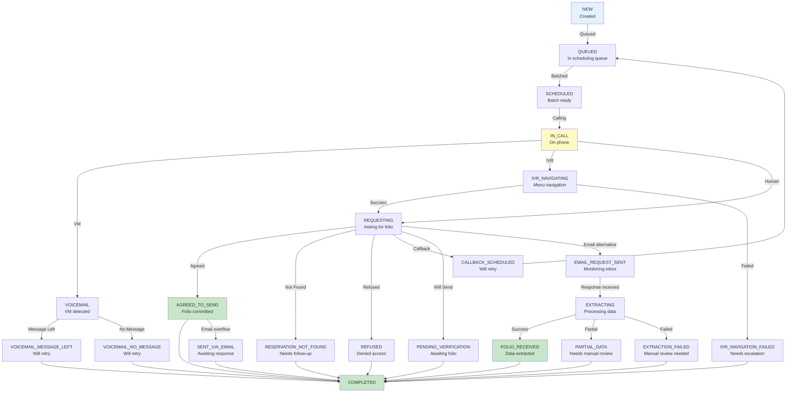

# Component Design: Status Manager

## Overview
The Status Manager maintains the current state of folio records by consuming all events and updating status accordingly. It never makes state queries - all state is reconstructed from the event log. It provides query projections for UI/API access.

## Interface

```
IStatusManager {
  UpdateStatus(record_id, status, metadata)
  GetRecordStatus(record_id) -> RecordStatus
  GetBatchStatus(batch_id) -> BatchStatus
  QueryRecords(filters) -> List<RecordStatus>
  GetStatusHistory(record_id) -> List<StatusEvent>

  // Events Emitted
  StatusUpdated(record_id, old_status, new_status, timestamp)
  RecordCompleted(record_id, final_status, folio_data)

  // Events Consumed
  [All events from all components]
}
```

## Responsibilities

1. **Event Consumption**
   - Listens to all events from all components
   - Processes events in order
   - Handles event ordering/causality
   - No direct state queries - events only

2. **Status Computation**
   - Derives current status from event stream
   - Maintains complete audit trail
   - Tracks state transitions
   - Computes aggregate status

3. **Query Projections**
   - Creates read-only projections for UI/API
   - Efficiently queries status without event replay
   - Maintains eventual consistency
   - Rebuilds from events on startup

4. **Audit Trail**
   - Stores all status transitions
   - Timestamps all changes
   - Tracks causation chains
   - Provides compliance reports

## Status State Machine



## Event-to-Status Mapping

```json
{
  "event_status_mapping": {
    "RecordCreated": {
      "new_status": "NEW",
      "record_state": {
        "status": "NEW",
        "created_at": "event.timestamp",
        "call_attempts": 0,
        "email_attempts": 0
      }
    },
    "RecordQueued": {
      "new_status": "QUEUED",
      "record_state_update": {
        "status": "QUEUED",
        "queued_at": "event.timestamp",
        "batch_id": "event.batch_id"
      }
    },
    "BatchScheduled": {
      "new_status": "SCHEDULED",
      "record_state_update": {
        "status": "SCHEDULED",
        "scheduled_at": "event.timestamp"
      }
    },
    "CallInitiated": {
      "new_status": "IN_CALL",
      "record_state_update": {
        "status": "IN_CALL",
        "call_id": "event.call_id",
        "call_start": "event.timestamp",
        "call_attempts": "increment"
      }
    },
    "FolioAgreed": {
      "new_status": "AGREED_TO_SEND",
      "record_state_update": {
        "status": "AGREED_TO_SEND",
        "agreement_time": "event.timestamp",
        "call_id": "event.call_id"
      }
    },
    "CallbackRequested": {
      "new_status": "CALLBACK_SCHEDULED",
      "record_state_update": {
        "status": "CALLBACK_SCHEDULED",
        "callback_time": "event.callback_time",
        "callback_id": "event.callback_id"
      }
    },
    "FolioExtracted": {
      "new_status": "FOLIO_RECEIVED",
      "record_state_update": {
        "status": "FOLIO_RECEIVED",
        "folio_data": "event.folio_data",
        "extraction_time": "event.timestamp"
      }
    }
  }
}
```

## Record Status Structure

```json
{
  "record_status": {
    "record_id": "req_001",
    "current_status": "AGREED_TO_SEND",
    "status_history": [
      {
        "status": "NEW",
        "timestamp": "2026-02-05T10:00:00Z",
        "event_id": "evt_rec_created_001"
      },
      {
        "status": "QUEUED",
        "timestamp": "2026-02-06T11:00:00Z",
        "event_id": "evt_rec_queued_001",
        "context": {"batch_id": "batch_001"}
      },
      {
        "status": "SCHEDULED",
        "timestamp": "2026-02-06T11:05:00Z",
        "event_id": "evt_batch_scheduled_001"
      },
      {
        "status": "IN_CALL",
        "timestamp": "2026-02-06T11:30:00Z",
        "event_id": "evt_call_initiated_001",
        "context": {"call_id": "call_001"}
      },
      {
        "status": "AGREED_TO_SEND",
        "timestamp": "2026-02-06T11:35:00Z",
        "event_id": "evt_folio_agreed_001"
      }
    ],
    "guest_name": "John Doe",
    "conf_number": "ABC123",
    "hotel_phone": "+1-501-555-1234",
    "checkin_date": "2026-02-01",
    "checkout_date": "2026-02-05",
    "destination_email": "john@example.com",
    "call_count": 1,
    "email_count": 0,
    "folio_data": null,
    "last_update": "2026-02-06T11:35:00Z",
    "completion_time": null,
    "duration_seconds": null
  }
}
```

## Status Projection View (for UI/API)

```json
{
  "status_projection": {
    "record_id": "req_001",
    "status": "AGREED_TO_SEND",
    "progress_percent": 75,
    "display_status": "Hotel Agreed - Awaiting Folio",
    "guest_info": {
      "name": "John Doe",
      "conf_number": "ABC123"
    },
    "hotel_info": {
      "phone": "+1-501-555-1234",
      "id": "hotel_001"
    },
    "timeline": [
      {
        "step": 1,
        "label": "Created",
        "timestamp": "2026-02-05T10:00:00Z",
        "status": "complete"
      },
      {
        "step": 2,
        "label": "Queued",
        "timestamp": "2026-02-06T11:00:00Z",
        "status": "complete"
      },
      {
        "step": 3,
        "label": "Batched & Called",
        "timestamp": "2026-02-06T11:30:00Z",
        "status": "complete"
      },
      {
        "step": 4,
        "label": "Awaiting Folio",
        "timestamp": "2026-02-06T11:35:00Z",
        "status": "in_progress"
      },
      {
        "step": 5,
        "label": "Complete",
        "timestamp": null,
        "status": "pending"
      }
    ],
    "next_action": "Wait for folio email",
    "estimated_completion": "2026-02-07T12:00:00Z"
  }
}
```

## Event Stream Processing

```
EventStore → [Event Stream] → StatusManager
                                    ↓
                            [Event Replay]
                                    ↓
                            [Current State]
                                    ↓
                     [Status Projections] → [Query Index]
                                    ↓
                          [UI/API Access]
```

### State Reconstruction Algorithm

```
function ComputeRecordStatus(record_id):
  events = EventStore.GetEventsForRecord(record_id)
  state = InitialState(record_id)

  for each event in events:
    state = ApplyEvent(state, event)
    LogStatusTransition(state)

  return state

function ApplyEvent(state, event):
  case event.type:
    "RecordCreated": return state.with(status: "NEW")
    "CallConnected": return state.with(status: "IN_CALL")
    "FolioAgreed": return state.with(status: "AGREED_TO_SEND")
    "FolioExtracted": return state.with(status: "FOLIO_RECEIVED")
    // ... other events
```

## Batch Status Aggregation

```json
{
  "batch_status": {
    "batch_id": "batch_20260206_hotel_15015551234_001",
    "hotel_id": "hotel_001",
    "hotel_phone": "+1-501-555-1234",
    "total_records": 5,
    "status_breakdown": {
      "AGREED_TO_SEND": 3,
      "CALLBACK_SCHEDULED": 1,
      "REFUSED": 1
    },
    "progress_percent": 80,
    "started_at": "2026-02-06T11:30:00Z",
    "completed_at": "2026-02-06T11:45:00Z",
    "duration_seconds": 900,
    "call_duration_seconds": 480,
    "folios_agreed": 3,
    "folios_refused": 1,
    "folios_pending_callback": 1
  }
}
```

## Configuration

```json
{
  "status_manager": {
    "event_replay_batch_size": 1000,
    "projection_update_frequency_ms": 5000,
    "audit_trail_retention_days": 365,
    "status_transition_logging": true,
    "causation_chain_tracking": true
  }
}
```

## Failure Handling

1. **Event Store Unavailable**
   - Use last known projection
   - Cache until store recovers
   - Alert on persistent unavailability

2. **Event Ordering Issue**
   - Detect via causation_id and sequence
   - Log as anomaly
   - Replay from last known good state

3. **Projection Staleness**
   - Regenerate on demand
   - Scheduled regeneration
   - Increment processing speed

## Monitoring & Observability

**Metrics:**
- Event processing rate
- Status transition frequency
- Projection update latency
- Query performance (by status)
- Audit trail size

**Logs:**
- All status transitions
- Event processing
- Projection updates
- Inconsistencies detected

